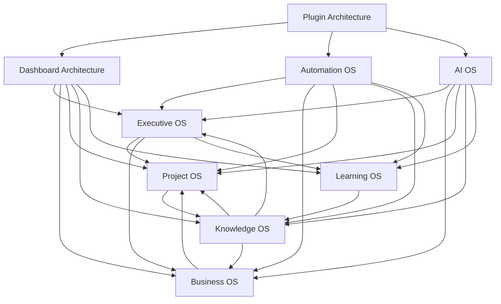
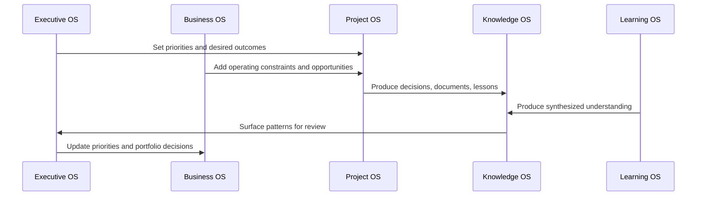

# LifeOS Enterprise — Architecture

> Canonical reference for the enterprise operating-system blueprint, system boundaries, and interaction model.

---

## Table of Contents

1. [Philosophy](#philosophy)
2. [Enterprise System Map](#enterprise-system-map)
3. [Core Operating Systems](#core-operating-systems)
4. [Interaction Contracts](#interaction-contracts)
5. [Cross-Cutting Architecture](#cross-cutting-architecture)
6. [Document Map](#document-map)
7. [Design Constraints](#design-constraints)

---

## Philosophy

LifeOS Enterprise treats a personal operating system as a set of coordinated business systems.
Each system has a clear purpose, owns a specific class of decisions, and exchanges structured data with adjacent systems.

The architecture follows four rules:

1. **Strategy drives execution** — long-horizon priorities govern projects, not the reverse.
2. **Execution produces knowledge** — work creates notes, decisions, lessons, and reusable assets.
3. **Knowledge compounds learning** — captured insight becomes curriculum, playbooks, and better judgment.
4. **Automation and AI augment, never replace, structure** — higher-order layers depend on typed notes and governance.

---

## Enterprise System Map

### Layer Model

| Layer | Purpose | Primary Outputs |
|------|---------|-----------------|
| Strategic | Executive OS, Business OS | goals, priorities, decisions, risks, opportunities |
| Execution | Project OS, Learning OS | projects, tasks, workflows, review outcomes |
| Knowledge | Knowledge OS | knowledge notes, resources, documents, patterns |
| Experience | Dashboard Architecture | operational views, review surfaces, command centers |
| Enablement | Plugin Architecture, Automation OS, AI OS | platform capabilities, orchestration, augmentation |

---

## Core Operating Systems

| System | Purpose | Canonical Inputs | Canonical Outputs | Primary Document |
|-------|---------|------------------|-------------------|------------------|
| Executive OS | Run strategy, reviews, prioritization, and portfolio control | goals, decisions, risks, opportunities, review notes | priorities, strategic decisions, review directives | [docs/EXECUTIVE_OS.md](./docs/EXECUTIVE_OS.md) |
| Business OS | Manage commercial entities, finances, operations, and relationships | business, company, asset, document, project, goal notes | business priorities, operating metrics, compliance artifacts | [docs/BUSINESS_OS.md](./docs/BUSINESS_OS.md) |
| Project OS | Convert priorities into bounded execution | goals, areas, business directives, risks | projects, tasks, status changes, deliverables | [docs/PROJECT_OS.md](./docs/PROJECT_OS.md) |
| Knowledge OS | Store, relate, retrieve, and govern durable knowledge | meetings, documents, resources, project lessons | knowledge notes, decision history, reference systems | [docs/KNOWLEDGE_OS.md](./docs/KNOWLEDGE_OS.md) |
| Learning OS | Turn resources and practice into skill development | resources, knowledge notes, goals, projects | learning plans, study workflows, capability growth | [docs/LEARNING_OS.md](./docs/LEARNING_OS.md) |
| AI OS | Provide AI-assisted capture, synthesis, and review support | structured note context and approved prompts | suggestions, summaries, classifications, briefings | [docs/AI_OS.md](./docs/AI_OS.md) |
| Automation OS | Run deterministic orchestration across the vault | typed metadata, schedules, events | created notes, reminders, validations, logs | [docs/AUTOMATION_OS.md](./docs/AUTOMATION_OS.md) |
| Dashboard Architecture | Surface system state through role-based views | typed notes and review outputs | command centers, dashboards, review surfaces | [docs/DASHBOARD_ARCHITECTURE.md](./docs/DASHBOARD_ARCHITECTURE.md) |
| Plugin Architecture | Define capability boundaries for Obsidian extensions | platform constraints and system requirements | approved plugin roles and dependency rules | [docs/PLUGIN_ARCHITECTURE.md](./docs/PLUGIN_ARCHITECTURE.md) |

---

## Interaction Contracts

### Core Contracts

| Source | Target | Contract | Governing Data |
|--------|--------|----------|----------------|
| Executive OS | Project OS | Strategic directives become active projects | `goal`, `decision`, `priority`, `review-cadence` |
| Executive OS | Business OS | Strategic priorities shape business focus and risk posture | `goal`, `business`, `risk`, `opportunity` |
| Business OS | Project OS | Operating needs generate projects and constraints | `business`, `document`, `asset`, `risk` |
| Project OS | Knowledge OS | Execution generates reusable context and lessons | `meeting`, `decision`, `document`, `knowledge` |
| Learning OS | Knowledge OS | Study outputs become durable knowledge | `resource`, `knowledge`, `workflow` |
| Knowledge OS | Executive OS | Reviews surface patterns, evidence, and decision support | `knowledge`, `decision`, `review` |
| Automation OS | All systems | Deterministic enforcement and scheduled maintenance | metadata, schedules, validation rules |
| AI OS | All systems | Augmentation with human approval and privacy controls | prompt context, structured note excerpts |
| Dashboard Architecture | All systems | Read-only views over canonical notes | typed notes and review outputs |

### Review Loop

---

## Cross-Cutting Architecture

### Dashboard Architecture
Dashboards are the read layer for every operating system. They do not own data and must remain replaceable.

### Plugin Architecture
Plugins provide capabilities, not policy. Policy lives in documentation and metadata; plugins only enable it.

### Automation OS
Automation provides deterministic workflows such as creation, validation, routing, reminders, and archival.
It must remain safe to disable without losing canonical data.

### AI OS
AI is an advisory layer for capture, synthesis, and review support.
No AI workflow is authoritative without human approval.

---

## Document Map

| Document | Scope |
|---------|-------|
| [PROJECT_TRUTH.md](./PROJECT_TRUTH.md) | Canonical decisions and constraints |
| [docs/EXECUTIVE_OS.md](./docs/EXECUTIVE_OS.md) | Strategic planning and review operating system |
| [docs/BUSINESS_OS.md](./docs/BUSINESS_OS.md) | Business and commercial operating system |
| [docs/PROJECT_OS.md](./docs/PROJECT_OS.md) | Execution and delivery operating system |
| [docs/KNOWLEDGE_OS.md](./docs/KNOWLEDGE_OS.md) | Knowledge capture, retrieval, and governance |
| [docs/LEARNING_OS.md](./docs/LEARNING_OS.md) | Learning design and capability development |
| [docs/AI_OS.md](./docs/AI_OS.md) | AI operating-system architecture, role registry, governance, and evaluation |
| [docs/AUTOMATION_OS.md](./docs/AUTOMATION_OS.md) | Automation operating-system architecture |
| [docs/DASHBOARD_ARCHITECTURE.md](./docs/DASHBOARD_ARCHITECTURE.md) | Dashboard read-layer architecture and dashboard specifications |
| [docs/PLUGIN_ARCHITECTURE.md](./docs/PLUGIN_ARCHITECTURE.md) | Plugin capability architecture and plugin evaluations |
| [docs/INTEGRATION_ARCHITECTURE.md](./docs/INTEGRATION_ARCHITECTURE.md) | External integration architecture and security model |
| [docs/AUTOMATION_SPEC.md](./docs/AUTOMATION_SPEC.md) | Legacy automation control-plane summary |
| [docs/DASHBOARD_SPEC.md](./docs/DASHBOARD_SPEC.md) | Legacy dashboard summary |
| [docs/PLUGIN_STACK.md](./docs/PLUGIN_STACK.md) | Legacy plugin capability summary |
| [docs/INTEGRATION_ROADMAP.md](./docs/INTEGRATION_ROADMAP.md) | Legacy internal/external integration sequencing roadmap |

---

## Design Constraints

1. **Markdown remains the source format.** No subsystem may require proprietary storage.
2. **Canonical ownership is explicit.** Each fact belongs to one note and one system of record.
3. **Higher layers degrade gracefully.** Dashboards, automation, plugins, and AI are optional accelerators.
4. **Implementation is deferred.** This phase defines architecture only; no templates, Dataview queries, plugin configuration, or operational automation are introduced here.
5. **Privacy is architectural.** Sensitive data handling must be explicit before any cloud integration.
6. **Every subsystem must be reviewable.** Reviews are part of the design, not future polish.
