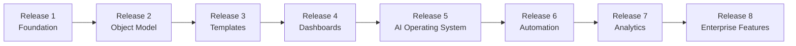

# LifeOS Enterprise — Implementation Roadmap

> Breaks LifeOS Enterprise into implementation releases after the architecture phase.

---

## Release 1 — Foundation

- **Goals:** Stabilize repository governance, architecture references, and contributor workflow.
- **Deliverables:** documentation baseline, contribution workflow, changelog discipline, pull-request flow, canonical architecture links.
- **Dependencies:** approved architecture documents and project truth.
- **Acceptance Criteria:** repository is navigable, architecture docs are canonical, contribution workflow is documented.
- **Risks:** documentation drift, unclear ownership, incomplete cross-links.
- **Estimated Complexity:** Medium.
- **Testing Strategy:** documentation completeness review, link checks, manual onboarding walkthrough.
- **Rollback Strategy:** revert documentation changes and restore last approved architecture baseline.

## Release 2 — Object Model

- **Goals:** Finalize vault-wide object definitions, metadata rules, and folder contracts.
- **Deliverables:** object model ratification, metadata schema finalization, folder structure validation, note-type inventory.
- **Dependencies:** Release 1, approved architecture, plugin minimalism rules.
- **Acceptance Criteria:** all note types have defined schema and canonical storage rules.
- **Risks:** schema churn, type overlap, migration burden later.
- **Estimated Complexity:** High.
- **Testing Strategy:** schema review, sample-note validation, cross-document consistency checks.
- **Rollback Strategy:** revert schema revisions and preserve prior approved model as the source of truth.

## Release 3 — Templates

- **Goals:** Build the template system for recurring notes and typed objects.
- **Deliverables:** daily, weekly, monthly, project, meeting, goal, knowledge, decision, and support templates.
- **Dependencies:** Releases 1-2, template specification, periodic-note conventions.
- **Acceptance Criteria:** each supported object type has a usable template that matches the schema.
- **Risks:** template sprawl, over-automation, schema drift.
- **Estimated Complexity:** High.
- **Testing Strategy:** real-vault template creation tests, frontmatter validation, manual UX review.
- **Rollback Strategy:** disable new templates and restore the previous approved template set.

## Release 4 — Dashboards

- **Goals:** Implement the read layer for daily, weekly, strategic, business, project, learning, and knowledge views.
- **Deliverables:** command center, review dashboards, domain dashboards, dashboard navigation framework.
- **Dependencies:** Releases 1-3, dashboard architecture, Dataview approval.
- **Acceptance Criteria:** dashboards answer the documented questions and render against representative sample data.
- **Risks:** query performance, hidden logic, duplicated state assumptions.
- **Estimated Complexity:** High.
- **Testing Strategy:** sample-data rendering, performance spot checks, dashboard question coverage review.
- **Rollback Strategy:** disable new dashboards and fall back to manual MOCs or review notes.

## Release 5 — AI Operating System

- **Goals:** Introduce governed AI roles, prompt architecture, workflow library, and evaluation practices.
- **Deliverables:** agent registry, prompt library, evaluation suite, approved AI workflows, privacy rules.
- **Dependencies:** Releases 1-4, AI OS, integration architecture for providers.
- **Acceptance Criteria:** every AI role has documented guardrails, evaluation coverage, and human approval points.
- **Risks:** privacy leakage, hallucinations, workflow overreach, cost drift.
- **Estimated Complexity:** Very High.
- **Testing Strategy:** prompt evaluations, red-team review, acceptance-rate tracking, privacy checks.
- **Rollback Strategy:** disable AI workflows, preserve prompts and evaluations, revert to manual workflows.

## Release 6 — Automation

- **Goals:** Implement deterministic automations that support reviews, hygiene, routing, and reminders.
- **Deliverables:** validation routines, review prep automations, archive prep, logging and health checks.
- **Dependencies:** Releases 1-5, Automation OS, integration architecture, stable schemas.
- **Acceptance Criteria:** write-capable automations are logged, non-destructive, and documented.
- **Risks:** silent failure, destructive writes, false positives, operational fragility.
- **Estimated Complexity:** Very High.
- **Testing Strategy:** dry runs, fixture-based tests, failure injection, log review.
- **Rollback Strategy:** disable automations, restore from Git history or backups, clear queued actions.

## Release 7 — Analytics

- **Goals:** Add KPI trend analysis, evaluation reporting, and system-health visibility.
- **Deliverables:** KPI rollups, review-completion analytics, AI evaluation summaries, automation health reporting.
- **Dependencies:** Releases 1-6, dashboard data quality, review-system consistency.
- **Acceptance Criteria:** key metrics are reproducible from canonical notes and support decision-making.
- **Risks:** misleading metrics, data incompleteness, dashboard bloat.
- **Estimated Complexity:** Medium-High.
- **Testing Strategy:** metric reconciliation, trend sanity checks, dashboard review against source notes.
- **Rollback Strategy:** remove derived analytics views and keep raw notes and reviews as canonical evidence.

## Release 8 — Enterprise Features

- **Goals:** Introduce advanced business, CRM, asset, integration, and portfolio capabilities.
- **Deliverables:** richer business workflows, external integration automations, enterprise dashboards, migration support.
- **Dependencies:** Releases 1-7, integration architecture, stable operating systems.
- **Acceptance Criteria:** advanced features respect canonical ownership, privacy, and graceful degradation rules.
- **Risks:** ecosystem fragility, excessive complexity, provider lock-in.
- **Estimated Complexity:** Very High.
- **Testing Strategy:** staged rollout, integration fixtures, scenario walkthroughs, rollback drills.
- **Rollback Strategy:** disable advanced features module-by-module and preserve canonical markdown state.

---

## Release Sequencing Diagram

