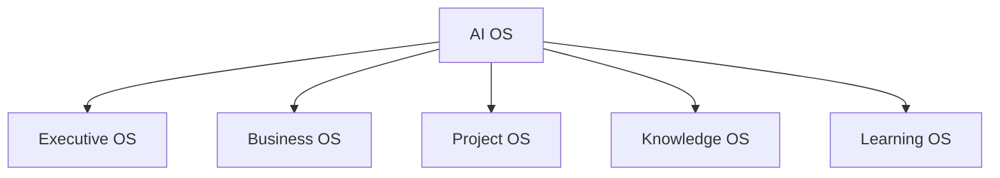

# LifeOS Enterprise — AI OS

> Defines the AI service layer, operating boundaries, and cross-system augmentation model for LifeOS Enterprise.

---

## Overview

The AI layer is the highest-order augmentation layer in the LifeOS architecture.
It does not replace any system below it.
It provides advisory, synthesis, classification, and retrieval support on top of structured notes.

This document defines:
- AI roles across the operating systems
- Service boundaries and safety constraints
- Workflow classes
- Provider strategy and privacy controls

---

## Architectural Role

| AI Role | Function | Human Approval Required? |
|--------|----------|--------------------------|
| Capture assistant | Turn raw input into structured drafts | Yes |
| Synthesizer | Summarize notes, projects, reviews, and resources | Yes |
| Analyst | Surface patterns, gaps, and anomalies | Yes |
| Retrieval augmenter | Assemble relevant context from existing notes | Yes |
| Review support | Draft briefings and prompts for reviews | Yes |

AI is never the canonical owner of metadata, decisions, or note state.

---

## Operating Principles

### Principle 1: AI Augments, Structure Governs
Structured notes remain the operating API for AI.

### Principle 2: Local First, Cloud Optional
Local models are preferred for sensitive workflows.

### Principle 3: Prompt as Code
Prompts and agents are documented, versioned, and reviewable.

### Principle 4: Bounded Context
AI receives only the minimum context needed for a task.

### Principle 5: Human-in-the-Loop
AI may draft or suggest, but humans approve structural changes.

---

## Cross-System Service Map

| Target System | Primary AI Services |
|--------------|---------------------|
| Executive OS | review briefings, risk summaries, goal alignment checks |
| Business OS | relationship prep, document summaries, operating snapshots |
| Project OS | project context briefs, meeting extraction, blocker summaries |
| Knowledge OS | synthesis, related-note suggestions, classification support |
| Learning OS | tutoring, curriculum synthesis, reflection prompts |

---

## Workflow Inventory

### Capture Workflows
- Smart capture normalization
- Voice or raw-text conversion to note drafts
- Meeting action-item extraction

### Synthesis Workflows
- Weekly and monthly synthesis
- Project context brief assembly
- Knowledge connection discovery

### Review Workflows
- Daily briefing drafts
- Review question generation
- Stale-item and alignment checks

---

## AI Interaction Pattern

1. A human or automation requests an AI workflow.
2. The workflow assembles approved context from typed notes.
3. AI returns a bounded output: summary, draft, classification, or suggestion.
4. A human accepts, edits, or rejects the output.
5. Only approved changes become part of the vault.

---

## Provider Strategy

| Criterion | Priority |
|-----------|----------|
| Privacy and data handling | High |
| Local operation capability | High |
| Output quality for synthesis and planning | High |
| Reliability and API stability | Medium |
| Cost | Medium |
| Native Obsidian ecosystem support | Low |

Candidate providers remain under evaluation. No provider is ratified in this phase.

---

## Privacy and Security Rules

1. Sensitive data requires explicit opt-in before cloud submission.
2. Prompts should use the minimum viable context.
3. Prompt logs must remain reviewable.
4. AI outputs are suggestions, not authoritative records.
5. Cloud use must respect the no-training requirement when provider terms allow it.

---

## Architectural Notes

- AI OS overlays every other operating system.
- It is intentionally valuable but non-essential.
- If disabled, the vault must remain fully functional through native notes, reviews, and dashboards.
