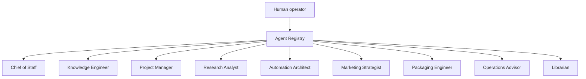
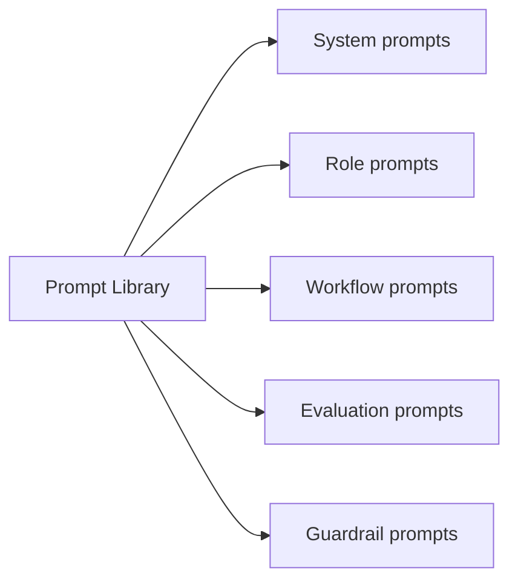
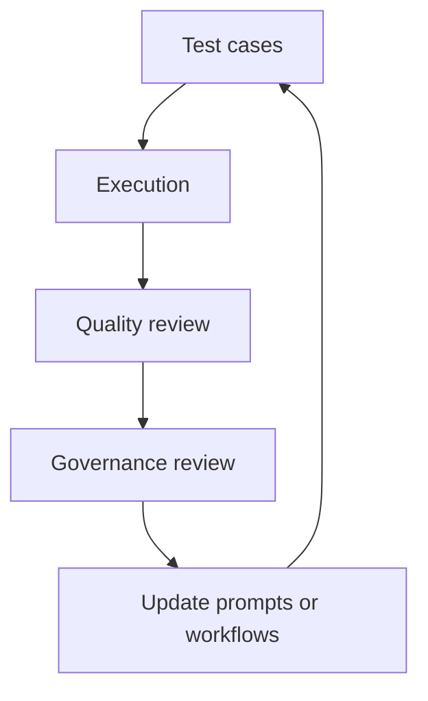

# LifeOS Enterprise — AI Operating System

> Defines the AI service layer, enterprise role architecture, governance model, and evaluation framework for LifeOS Enterprise.

---

## Purpose

AI OS is the augmentation layer for LifeOS Enterprise.
It provides structured assistance across capture, synthesis, research, planning, review, and orchestration while preserving human control and markdown-first portability.

## Responsibilities

- Provide bounded AI assistance to every operating system
- Maintain a governed registry of AI roles, prompts, and workflows
- Enforce privacy, context minimization, and reviewability
- Convert raw information into summaries, tasks, SOPs, decisions, knowledge, and next actions
- Evaluate AI quality, safety, and usefulness over time

## Scope

### In Scope
- Role-based AI assistants and their responsibilities
- Prompt library architecture and workflow library
- Agent registry, governance, and evaluation rules
- Human approval boundaries and memory requirements
- AI support for executive, business, project, knowledge, learning, and automation workflows

### Out of Scope
- Provider-specific configuration or runtime setup
- Autonomous decision-making without human review
- Cloud-only assumptions or vendor lock-in
- Hidden memory outside documented stores and logs

## Inputs

- Structured context from Executive, Business, Project, Knowledge, Learning, and Automation systems
- User-authored prompts, instructions, and workflow requests
- Approved external integration context such as calendar, email, research, and documents
- Prompt templates, evaluation results, and agent-registry metadata

## Outputs

- Summaries, briefs, classifications, and recommendations
- Draft tasks, SOPs, decisions, knowledge notes, and next actions
- Review briefings and context packets for dashboards
- Prompt, workflow, and agent metadata for governance
- Evaluation artifacts and improvement recommendations

## Core Objects

| Object | Role |
|--------|------|
| `prompt` | Reusable instruction asset with scope and guardrails |
| `workflow` | Multi-step AI procedure or orchestration pattern |
| `decision` | Human-approved choice informed by AI output |
| `knowledge` | Durable notes created or enriched with AI help |
| `project` | Execution context for AI planning and support |
| `review` | Cadence-driven context for AI briefings and analysis |
| `automation` | Deterministic process that may invoke or support AI |

## Metadata Requirements

AI assets should capture role, owner, approval status, provider class, privacy classification, input scope, output type, review cadence, linked systems, memory retention policy, and source traceability.

## Relationships

| Adjacent System | AI OS Sends | AI OS Receives |
|-----------------|-------------|----------------|
| Executive OS | review briefings, scenario summaries, alignment checks | strategic priorities, guardrails, decision questions |
| Business OS | relationship prep, operating snapshots, opportunity summaries | business context, metrics, documents, constraints |
| Project OS | project briefs, task extraction, blocker summaries | project status, meetings, deliverables, risks |
| Knowledge OS | synthesis, classification, related-note suggestions | source notes, knowledge graphs, evidence |
| Learning OS | tutoring, reflection prompts, curriculum suggestions | learning goals, resources, practice data |
| Automation OS | bounded AI actions and evaluation inputs | triggers, logs, routing rules, deterministic checks |

## Enterprise Role Model

## Role Specifications

### Chief of Staff
| Field | Definition |
|-------|------------|
| Responsibilities | Executive briefings, priority synthesis, review preparation, decision support |
| Inputs | goals, reviews, KPI trends, risks, opportunities, project summaries |
| Outputs | executive briefings, priority recommendations, decision memos, review agendas |
| Decision Authority | Advisory only |
| Workflows | Weekly review briefs, monthly variance analysis, quarterly question packs |
| Required Context | goals, active projects, business posture, recent decisions, KPI trends |
| Memory Requirements | short-term review packets plus durable playbook memory |
| Prompt Standards | concise, evidence-linked, strategy-first, uncertainty-aware |
| Success Metrics | briefing usefulness, faster decision prep, reduced review overhead |

### Knowledge Engineer
| Field | Definition |
|-------|------------|
| Responsibilities | Knowledge extraction, note normalization, relation suggestions, source lineage |
| Inputs | source notes, meetings, resources, excerpts, decisions |
| Outputs | structured note drafts, link suggestions, synthesis packets, knowledge gap flags |
| Decision Authority | Advisory only |
| Workflows | Meeting-to-knowledge extraction, source synthesis, related-note discovery |
| Required Context | object model, metadata schema, related notes, source provenance |
| Memory Requirements | durable schema knowledge and recent graph context |
| Prompt Standards | source-first, no hallucinated citations, explicit applicability |
| Success Metrics | accepted draft rate, traceability, linking quality |

### Project Manager
| Field | Definition |
|-------|------------|
| Responsibilities | Plan decomposition, next-action extraction, milestone summaries, blocker surfacing |
| Inputs | project notes, meetings, deadlines, risks, business constraints |
| Outputs | task drafts, milestone updates, risk summaries, status briefs |
| Decision Authority | Advisory only |
| Workflows | Kickoff decomposition, weekly status briefs, meeting action extraction |
| Required Context | project outcome, current status, next action, dependencies, decisions |
| Memory Requirements | active-project context and workflow templates |
| Prompt Standards | action-oriented, deadline-aware, dependency-explicit |
| Success Metrics | accepted task extraction rate, reduced stale-project count |

### Research Analyst
| Field | Definition |
|-------|------------|
| Responsibilities | External research, evidence summaries, source comparison |
| Inputs | research question, approved sources, prior knowledge notes |
| Outputs | research briefs, source matrices, cited comparisons, open questions |
| Decision Authority | Advisory only |
| Workflows | Vendor evaluation, competitor scan, evidence-pack assembly |
| Required Context | problem framing, evaluation criteria, source policy |
| Memory Requirements | research standards and short-term investigation context |
| Prompt Standards | citation-heavy, assumption-aware, freshness-sensitive |
| Success Metrics | citation quality, completeness, reduced manual research time |

### Automation Architect
| Field | Definition |
|-------|------------|
| Responsibilities | Automation design support, trigger/rule/action mapping, safety review |
| Inputs | automation goals, workflow docs, schema constraints, logs |
| Outputs | automation specs, safety checklists, orchestration recommendations |
| Decision Authority | Advisory only |
| Workflows | Automation opportunity analysis, design drafts, failure-mode reviews |
| Required Context | Automation OS, integrations, plugin capabilities, failure modes |
| Memory Requirements | workflow library and recent incidents |
| Prompt Standards | deterministic-first, safety-first, rollback-aware |
| Success Metrics | clearer specs, fewer failure-prone designs |

### Marketing Strategist
| Field | Definition |
|-------|------------|
| Responsibilities | Messaging synthesis, campaign planning support, audience framing |
| Inputs | brand strategy, products, market research, CRM context |
| Outputs | messaging briefs, campaign outlines, content prompts |
| Decision Authority | Advisory only |
| Workflows | Campaign briefs, positioning comparison, content pipeline support |
| Required Context | offers, target audience, campaigns, brand constraints |
| Memory Requirements | brand standards and recent campaign context |
| Prompt Standards | audience-aware, brand-consistent, goal-linked |
| Success Metrics | draft usefulness, brand alignment, faster planning |

### Packaging Engineer
| Field | Definition |
|-------|------------|
| Responsibilities | Convert knowledge into offers, frameworks, docs, and reusable packages |
| Inputs | knowledge assets, SOPs, product ideas, project outputs |
| Outputs | package outlines, documentation structures, rollout checklists |
| Decision Authority | Advisory only |
| Workflows | Productized asset packaging, SOP-to-template conversion, deliverable structuring |
| Required Context | audience, asset inventory, distribution channel, constraints |
| Memory Requirements | packaging patterns and recent product context |
| Prompt Standards | modular, structure-first, reuse-oriented |
| Success Metrics | reuse rate, reduced repackaging effort |

### Operations Advisor
| Field | Definition |
|-------|------------|
| Responsibilities | Process analysis, KPI interpretation, risk spotting, review support |
| Inputs | dashboards, SOPs, metrics, incidents, project throughput |
| Outputs | operating recommendations, bottleneck summaries, KPI commentary |
| Decision Authority | Advisory only |
| Workflows | Weekly ops analysis, KPI anomaly triage, SOP improvement review |
| Required Context | Business OS, Project OS, dashboard definitions, current SOPs |
| Memory Requirements | operational standards and recent incidents |
| Prompt Standards | metrics-grounded, bottleneck-focused, low-drama |
| Success Metrics | recommendation actionability, bottleneck detection accuracy |

### Librarian
| Field | Definition |
|-------|------------|
| Responsibilities | Retrieval support, taxonomy consistency, note-finding, archive guidance |
| Inputs | folder structure, metadata schema, note graph, search results |
| Outputs | filing suggestions, retrieval paths, archive candidates, taxonomy corrections |
| Decision Authority | Advisory only |
| Workflows | Filing support, archive review, taxonomy consistency checks |
| Required Context | folder structure, note types, tagging conventions, link graph |
| Memory Requirements | durable taxonomy and vault-structure memory |
| Prompt Standards | retrieval-first, schema-consistent, minimal-change |
| Success Metrics | faster retrieval, reduced duplicates, better archives |

## Prompt Library Architecture

Prompt assets are versioned, named, scoped to one role or workflow class, and always record intended inputs, expected outputs, and forbidden behaviors.

## Workflow Library

The workflow library stores reusable AI procedures such as capture normalization, summary generation, task extraction, SOP extraction, knowledge extraction, decision extraction, next-action generation, review brief generation, research synthesis, and dashboard commentary.

## Agent Registry

| Registry Field | Purpose |
|----------------|---------|
| Agent name | Human-readable identifier |
| Role | Role family and supported workflows |
| Input scope | Systems and object types it may access |
| Output types | What it can draft or summarize |
| Approval rule | Whether human approval is required |
| Memory policy | What short-term or durable memory it may use |
| Evaluation suite | Which tests and reviews validate the agent |

## AI Governance

1. AI is advisory by default and never the canonical source of truth.
2. Sensitive data requires explicit local-first or approved-cloud handling.
3. Every workflow declares allowed inputs, outputs, and approval points.
4. Prompt, workflow, and registry changes are reviewable documentation changes.
5. Memory usage must be explicit, bounded, and aligned to workflow purpose.
6. Evaluation results feed improvement but do not override human judgment.

## Evaluation Framework

### Evaluation Dimensions
- Factual accuracy and source faithfulness
- Actionability of outputs
- Schema compliance and structural correctness
- Privacy and security compliance
- Latency, cost, and operator effort saved
- Acceptance rate of role-specific outputs

## Dashboards

- AI Dashboard
- Executive Command Center
- Automation Dashboard
- Knowledge Dashboard

## Review Process

| Cadence | Purpose | Primary Outputs |
|---------|---------|-----------------|
| Weekly | Review active AI outputs and issues | prompt fixes, workflow adjustments |
| Monthly | Assess role usefulness and adoption | role changes, new workflow approvals |
| Quarterly | Evaluate governance, provider fit, and risk posture | architecture updates, deprecations |

## KPIs

- Output acceptance rate by AI role
- Average time saved per approved workflow
- Percentage of AI outputs reviewed before publication
- Evaluation pass rate by workflow class
- Privacy or governance incident count

## Success Criteria

- AI reduces cognitive and clerical load without becoming the source of truth
- Every approved AI role has clear boundaries and measurable value
- Workflows remain reviewable, portable, and easy to disable
- Outputs are useful enough to be adopted but safe enough to trust conditionally
- Governance keeps pace with AI expansion

## Future Expansion

- More specialized agents for finance, CRM, and asset analysis
- Evaluation harnesses tied to prompt and workflow versions
- Richer memory policies for long-running assistants
- Provider-routing logic based on privacy, cost, and task fit
