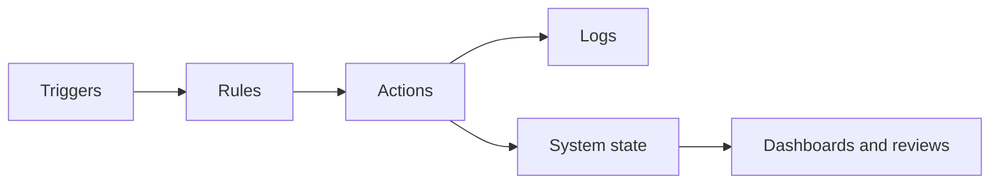

# LifeOS Enterprise — Automation Operating System

> Defines the deterministic orchestration layer that keeps LifeOS Enterprise consistent, timely, and reviewable.

---

## Purpose

Automation OS is the deterministic control plane for repeatable system behavior.
It reduces manual maintenance without changing canonical ownership or hiding system state.

## Responsibilities

- Generate predictable notes and review scaffolds
- Validate metadata, links, and system rules
- Route items into review, archive, or exception flows
- Surface stale items, failures, and overdue work
- Preserve observable logs for automated activity

## Scope

### In Scope
- Trigger, rule, and action architecture
- In-vault and external automation categories
- Safety and failure-handling rules
- Cross-system automation responsibilities
- Auditability and logging expectations

### Out of Scope
- Provider-specific automation setup
- Destructive autonomous workflows
- Hidden writes without documented triggers
- Replacing human review with automation decisions

## Inputs

- Typed metadata and linked notes
- Review schedules and cadence rules
- Integration events and external signals
- Workflow definitions and policy documents
- AI-assisted recommendations that still require deterministic rules

## Outputs

- Created notes, reminders, flags, and logs
- Validation results and stale-item signals
- Routed items for review or archive handling
- Health summaries for dashboards and governance reviews

## Core Objects

| Object | Role |
|--------|------|
| `workflow` | Encodes repeatable operating procedure |
| `automation` | Represents a deterministic routine or capability |
| `review` | Provides cadence targets and completion context |
| `project` | Supplies execution objects for stale or due checks |
| `knowledge` | Supplies integrity and archive targets |
| `decision` | Captures approvals for material automation changes |

## Metadata Requirements

Automation assets should capture trigger type, schedule, owner, approval status, affected object types and systems, failure policy, log location, review cadence, and links to the workflow or SOP being enforced.

## Relationships

| Adjacent System | Automation OS Sends | Automation OS Receives |
|-----------------|--------------------|------------------------|
| Executive OS | review reminders, portfolio hygiene signals | cadence rules and governance thresholds |
| Business OS | document renewal reminders, stale-entity checks | business schedules and risk rules |
| Project OS | next-action enforcement, stale-project detection, archival workflows | project state, deadlines, blockers |
| Knowledge OS | metadata validation, stale-note checks, archive prep | note graph, source integrity rules |
| Learning OS | study reminders, synthesis prompts | learning cadences and resource states |
| AI OS | deterministic envelopes for AI-assisted workflows | suggestions and extracted drafts |

## Workflows

### Core Workflow Classes
1. Time-based review preparation
2. Validation and hygiene checks
3. Routing and archive preparation
4. Reminder and escalation flows
5. Health-check reporting

## Dashboards

- Automation Dashboard
- Daily Dashboard
- Weekly Review
- Executive Command Center

## Review Process

| Cadence | Purpose | Primary Outputs |
|---------|---------|-----------------|
| Weekly | Review failures and stale detections | fixes, suppressed false positives |
| Monthly | Review automation coverage and safety | new automation candidates, retirements |
| Quarterly | Review architecture, providers, and risks | policy updates and hardening |

## KPIs

- Percentage of critical automations with observable logs
- Number of unresolved automation failures by review period
- Reduction in stale items due to automation support
- Percentage of write-capable automations with documented approval rules
- False-positive rate for validation automations

## Success Criteria

- Automation reduces manual maintenance without obscuring system state
- Failures are visible, recoverable, and non-destructive
- Canonical ownership remains explicit after automation is introduced
- Automations can be disabled without losing important data
- Governance keeps automation behavior aligned with documented policy

## Future Expansion

- Automation catalog with lifecycle state and maturity scores
- Stronger incident-review workflow for automation failures
- Richer integration-driven triggers with privacy classification rules
- Test harnesses for high-impact automation flows
