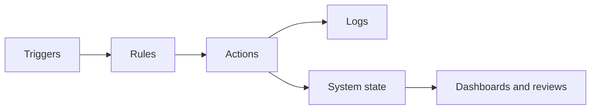

# LifeOS Enterprise — Automation Operating System

> Defines the deterministic orchestration layer that keeps LifeOS Enterprise consistent, timely, and reviewable.

---

## Overview

Automation OS is the control plane for repeatable system behavior.
It handles routine operations that should happen the same way every time, such as note generation, validation, reminders, routing, and archival support.

Automation exists at two levels:

1. **In-vault automation** — Obsidian or Templater-triggered actions
2. **External automation** — scripts, schedulers, CI, or service-driven flows

---

## Architectural Role

| Automation Role | Purpose |
|-----------------|---------|
| Creation | Generate predictable notes and structures |
| Validation | Enforce metadata, links, and system rules |
| Routing | Move items into the right review or archive flows |
| Monitoring | Surface stale items, overdue reviews, and failures |
| Logging | Preserve an audit trail of automated activity |

Automation owns repeatability, not strategy.

---

## Operating Principles

### 1. Idempotent by Default
Running an automation multiple times must not corrupt state.

### 2. Non-Destructive by Default
Automations archive, flag, or create; they do not silently delete.

### 3. Observable by Default
Actions must be logged or otherwise inspectable.

### 4. Policy Comes from Documentation
Automations enforce documented rules; they do not invent them.

### 5. Graceful Failure
Errors should preserve data and surface actionable recovery information.

---

## Control Plane Architecture

### Trigger Types

| Trigger Type | Examples |
|-------------|----------|
| Time-based | daily review prep, weekly stale-project scan |
| Event-based | note creation, project completion, review completion |
| Validation-based | schema failure, broken link, missing next action |
| External | webhook, imported calendar event, CI run |

### Action Types

| Action Type | Examples |
|------------|----------|
| Create | daily note, review note, capture draft |
| Update | modified-date, review-status, archive marker |
| Flag | overdue review, stale project, invalid metadata |
| Route | move completed work to archive queues |
| Report | write log entries, generate health summaries |

---

## Cross-System Responsibilities

| Target System | Automation Responsibility |
|--------------|---------------------------|
| Executive OS | review reminders, portfolio hygiene signals |
| Business OS | document renewal reminders, stale-entity checks |
| Project OS | next-action enforcement, stale-project detection, archival workflows |
| Knowledge OS | link integrity, metadata validation, stale-note checks |
| Learning OS | study cadence reminders, synthesis prompts |
| Dashboard Architecture | supply reliable state for views, not view logic |

---

## Script Inventory Direction

Future automations may include:
- frontmatter validation
- link integrity checking
- daily note creation support
- review reminder flows
- archive preparation routines
- health-check reporting

This phase defines the architecture only; it does not introduce those implementations.

---

## Safety Rules

1. Every write-capable automation must have a documented trigger and output.
2. Destructive behavior requires explicit human confirmation.
3. Scripted changes must remain explainable from logs.
4. Automation must degrade safely if a plugin or integration is unavailable.
5. Automation cannot replace the review system; it only supports it.

---

## Architectural Notes

- Automation OS depends on the object model, metadata schema, and review rules.
- It should remain modular so individual automations can be enabled or disabled independently.
- It is the primary bridge between documented policy and repeatable operation.
