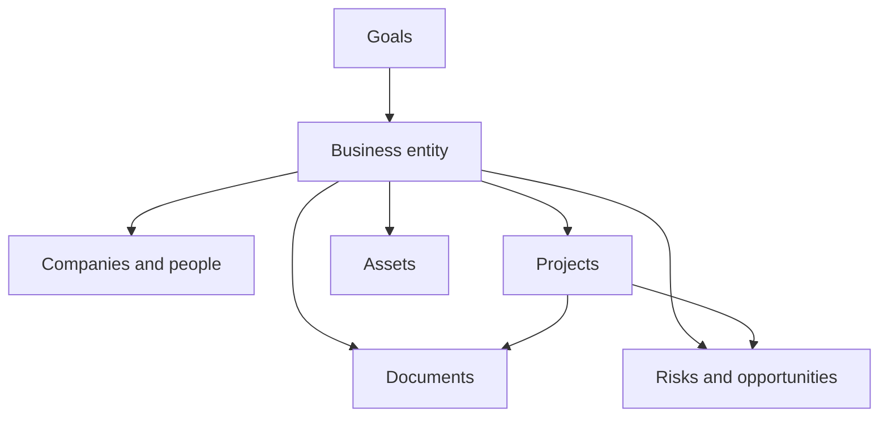

# LifeOS Enterprise — Business Operating System

> Defines the architecture for running business entities, commercial relationships, financial awareness, and operating risk inside LifeOS Enterprise.

---

## Purpose

Business OS manages every commercial context inside LifeOS Enterprise.
It connects strategic intent to entities, relationships, assets, documents, obligations, and operating performance.

## Responsibilities

- Track businesses, companies, people, and commercial relationships
- Maintain business-linked goals, projects, assets, and documents
- Surface financial awareness, compliance obligations, and operating risk
- Support recurring reviews of entity health and opportunity pipeline
- Preserve commercial memory for proposals, agreements, and decisions

## Scope

### In Scope
- Business entities and operating contexts
- Relationship and stakeholder tracking
- Business-linked goals, projects, and risks
- Asset awareness and key operating documents
- Revenue, exposure, and review visibility

### Out of Scope
- Full accounting-ledger implementation
- Payroll or tax software replacement
- Team collaboration tooling
- Plugin or integration configuration details

## Inputs

- Strategic priorities from Executive OS
- Project outcomes and blockers from Project OS
- Documents, meetings, and learned patterns from Knowledge OS
- Finance and relationship events from integrations
- Alerts and summaries from Automation OS and AI OS

## Outputs

- Business priorities, constraints, and operating context
- Entity health assessments and risk posture
- Business-linked projects, decisions, and reviews
- Document registers, asset awareness, and opportunity tracking
- Data feeds for business, finance, CRM, and asset dashboards

## Core Objects

| Object | Role |
|--------|------|
| `business` | Represents a business, venture, or operating context |
| `company` | Represents external organizations tied to the business |
| `person` | Represents stakeholders, customers, vendors, or advisors |
| `project` | Executes business initiatives |
| `document` | Stores contracts, proposals, reports, and key records |
| `asset` | Tracks high-value resources, IP, or tools |
| `risk` | Tracks business downside exposure |
| `opportunity` | Tracks growth or leverage potential |
| `goal` | Connects business activity to broader strategy |

## Metadata Requirements

Business notes should prioritize `status`, `priority`, `owner`, `review`, `deadline`, `impact`, typed links between `business`, `company`, `person`, `project`, `asset`, and `document`, and tags that distinguish sales, finance, legal, operations, and marketing contexts.

## Relationships

| Adjacent System | Business OS Sends | Business OS Receives |
|-----------------|-------------------|----------------------|
| Executive OS | entity health, risk posture, opportunity pipeline | strategic priorities and portfolio decisions |
| Project OS | business constraints, initiatives, stakeholders | project outcomes, delivery status, blockers |
| Knowledge OS | documents, meeting context, operating lessons | reusable playbooks, patterns, decision history |
| Learning OS | capability gaps and role demands | business-relevant learning plans |
| AI OS | bounded business context for synthesis | briefings, summaries, relationship prep |
| Automation OS | review schedules, renewal checks, stale-entity checks | reminders, validation logs, routing actions |

## Workflows

### Business Control Loop
1. Establish or update the business context, relationships, and obligations.
2. Link active goals, projects, assets, and documents to the business.
3. Review revenue, exposure, commitments, and risks.
4. Escalate decisions to Executive OS when priorities or posture change.
5. Archive or transition entities while preserving history.

## Dashboards

- Business Dashboard
- Finance Dashboard
- CRM Dashboard
- Asset Dashboard
- Executive Command Center

## Review Process

| Cadence | Purpose | Primary Outputs |
|---------|---------|-----------------|
| Weekly | Surface urgent business issues and follow-ups | relationship actions, risk escalations |
| Monthly | Review entity health and operating metrics | business corrections, document actions |
| Quarterly | Evaluate portfolio quality and growth bets | continuation, investment, or exit decisions |

## KPIs

- Percentage of active businesses with a current review cadence
- Number of expiring documents without a visible next step
- Number of business-linked projects lacking a next action
- Ratio of opportunities reviewed within cadence
- Concentration of risk by business or revenue stream

## Success Criteria

- Every business context has an accountable owner and review rhythm
- Commercial commitments and renewals are visible before deadlines
- Business projects inherit clear context and constraints
- Risks, opportunities, and assets are easy to retrieve during reviews
- Business history remains discoverable after transition or archive

## Future Expansion

- Explicit finance object model and ledger-adjacent integrations
- Lightweight customer and pipeline stages for CRM use cases
- Deeper document lifecycle automation for renewals and compliance
- External reporting exports for advisors or tax prep
