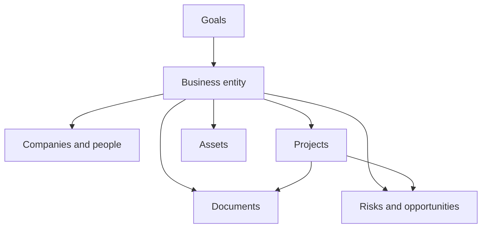

# LifeOS Enterprise — Business Operating System

> Defines the architecture for running business entities, commercial relationships, financial awareness, and operating risk inside LifeOS Enterprise.

---

## Overview

Business OS governs any entity with commercial intent or operating responsibility.
It is the subsystem that answers:

- What businesses or commercial relationships exist?
- What projects support them?
- Which assets, documents, and relationships matter?
- What are the most important operating risks and opportunities?

Business OS may support an employer context, consulting practice, side business, or investment vehicle.

---

## Scope

### In Scope
- Business entities and commercial contexts
- Company and relationship tracking
- Business-linked goals and projects
- Asset awareness and operating documents
- Risk, opportunity, and review flows tied to businesses

### Out of Scope
- Full accounting ledger implementation
- Tax software replacement
- Team collaboration tooling
- Plugin or integration configuration

---

## Domain Model

| Domain | Primary Objects | Function |
|-------|-----------------|----------|
| Entity Management | `business`, `company`, `person` | Define the commercial graph |
| Execution | `project`, `task`, `workflow` | Deliver initiatives tied to entities |
| Governance | `decision`, `document`, `risk`, `opportunity` | Control commitments, obligations, and bets |
| Resource Management | `asset`, `tool`, `automation` | Track operating resources |
| Strategy | `goal`, `area` | Connect business activity to broader priorities |

---

## Operating Domains

### Business Control Surfaces

| Surface | Purpose |
|---------|---------|
| Entity health | Track stage, cadence, and relationship state |
| Delivery health | Ensure business-critical projects have owners and next actions |
| Commercial memory | Preserve agreements, proposals, reports, and decisions |
| Capital awareness | Track high-value assets and obligations |
| Risk posture | Surface operating, market, and concentration risks |

---

## Business Lifecycle

1. **Establish context** — create the business entity and linked companies or people.
2. **Set strategic intent** — define business goals and review cadence.
3. **Run execution** — create projects, documents, meetings, and workflows.
4. **Review health** — assess stage, performance, risks, and dependencies.
5. **Archive or transition** — retire entities without deleting their history.

---

## Interfaces to Other Systems

| Adjacent System | Business OS Sends | Business OS Receives |
|-----------------|-------------------|----------------------|
| Executive OS | entity health, risk posture, opportunity pipeline | strategic priorities and portfolio decisions |
| Project OS | business constraints, initiatives, stakeholders | project outcomes, delivery status, blockers |
| Knowledge OS | documents, meeting context, operating lessons | reusable playbooks, patterns, decision history |
| Learning OS | capability gaps and role demands | business-relevant learning plans |
| Automation OS | review schedules, document checks, stale-entity checks | reminders, validation logs, routing actions |
| AI OS | bounded business context for synthesis | briefings, summaries, relationship prep |

---

## Business Views

| View | Purpose |
|------|---------|
| Business Portfolio | All businesses by stage, cadence, and active risk |
| Revenue & Growth Review | Business-linked goals, projects, and opportunities |
| Relationship Map | Key companies, people, and current commitments |
| Document Register | Contracts, proposals, reports, renewals |
| Asset & Exposure View | Valuable assets and concentrations by business |

---

## Governance Rules

1. Every active business should link to an area and a review cadence.
2. High-risk or document-heavy work must produce explicit decision records.
3. Business projects inherit both strategic and operating constraints.
4. Expiring documents require visible review before they lapse.
5. Business OS owns commercial context; Project OS owns delivery mechanics.

---

## Architectural Notes

- Business OS is optional for purely personal domains, but first-class when commercial work exists.
- It should support both one-person operations and a portfolio of multiple businesses.
- It relies on the common metadata contract rather than business-specific tooling.
