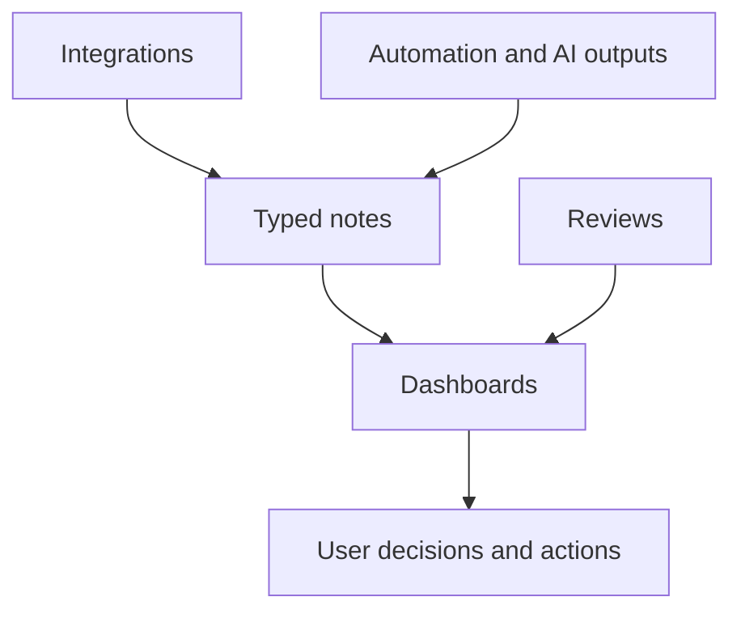

# LifeOS Enterprise — Dashboard Architecture

> Defines the dashboard layer that surfaces the state of every operating system without becoming a source of truth itself.

---

## Purpose

Dashboards are the read layer for LifeOS Enterprise.
They answer the right operational questions at the right cadence while reading from canonical notes, metadata, and review outputs.

## Principles

1. Dashboards are views, not storage.
2. Every dashboard must answer a concrete set of questions.
3. Views should default to actionable signal over exhaustive detail.
4. Filters and widgets must map back to canonical objects and metadata.
5. Dataview implementation is intentionally deferred.

## Architecture Model

## Dashboard Specifications

### Executive Command Center
- **Purpose:** Strategic operating surface for priorities, risks, decisions, and portfolio health.
- **Audience:** Primary operator in executive mode.
- **Questions Answered:** What matters most now? Where is risk rising? Which decisions need action?
- **Required Data:** goals, projects, risks, opportunities, review outcomes, KPI trends.
- **Filters:** time horizon, area, business, status, priority.
- **Widgets:** top priorities, active risks, decision register, KPI snapshot, portfolio heatmap.
- **KPIs:** goal alignment rate, reviewed-decision rate, unmanaged-risk count.
- **Visual Layout:** top-row KPI band, middle strategic focus panels, bottom review and risk panels.
- **Navigation:** links to Weekly Review, Business Dashboard, Project Dashboard, AI Dashboard.
- **Future Automation:** auto-generated executive briefs and variance alerts.

### Daily Dashboard
- **Purpose:** Daily command surface for focus, commitments, and operational hygiene.
- **Audience:** Primary operator during daily execution.
- **Questions Answered:** What must happen today? What is due, blocked, or stale?
- **Required Data:** daily note, tasks, projects, meetings, reminders, inbox items.
- **Filters:** today, next 3 days, area, energy, business.
- **Widgets:** today's priorities, due tasks, calendar strip, inbox count, blocker panel.
- **KPIs:** daily completion rate, overdue-task count, inbox-to-zero progress.
- **Visual Layout:** left action column, center schedule/focus area, right exceptions panel.
- **Navigation:** links to Project Dashboard, Weekly Review, CRM Dashboard.
- **Future Automation:** morning brief, end-of-day recap, stale-task highlighting.

### Weekly Review
- **Purpose:** Weekly decision and maintenance surface.
- **Audience:** Primary operator during review cadence.
- **Questions Answered:** What drifted this week? What needs cleanup, escalation, or commitment next week?
- **Required Data:** active projects, tasks, inbox, recent decisions, dashboards, review notes.
- **Filters:** current week, business, project status, task status.
- **Widgets:** wins/misses, stale projects, missing next actions, inbox review, decision follow-ups.
- **KPIs:** projects reviewed on time, next-action coverage, inbox processed rate.
- **Visual Layout:** top summary band, center review checklist, bottom exception queues.
- **Navigation:** links to Daily Dashboard, Executive Command Center, Knowledge Dashboard.
- **Future Automation:** prefilled review packets and exception summaries.

### Monthly Review
- **Purpose:** Portfolio and trend-analysis surface for month-level governance.
- **Audience:** Primary operator in strategic review mode.
- **Questions Answered:** Which trends matter? What should continue, pause, or change next month?
- **Required Data:** monthly review notes, KPI history, project progress, business trends, learning progress.
- **Filters:** month, area, business, KPI family.
- **Widgets:** KPI trend charts, project aging, decision backlog, learning progress, risk changes.
- **KPIs:** monthly goal progress, completion rate, review completion rate.
- **Visual Layout:** trend band on top, portfolio middle, review decisions bottom.
- **Navigation:** links to Executive Command Center and system-specific dashboards.
- **Future Automation:** month-end summary and anomaly detection.

### Business Dashboard
- **Purpose:** Business health and commercial operating surface.
- **Audience:** Operator in business mode.
- **Questions Answered:** Which businesses need attention? What are the main commitments, risks, and opportunities?
- **Required Data:** businesses, companies, people, documents, projects, risks, opportunities.
- **Filters:** business, stage, owner, review cadence.
- **Widgets:** entity health board, opportunity list, risk list, renewal calendar, linked-project panel.
- **KPIs:** reviewed-business rate, expiring-document count, opportunity review rate.
- **Visual Layout:** left entity/status column, center commitments, right risks/opportunities.
- **Navigation:** links to Finance Dashboard, CRM Dashboard, Asset Dashboard, Project Dashboard.
- **Future Automation:** renewal alerts, business-brief generation, stale-entity detection.

### Project Dashboard
- **Purpose:** Portfolio execution and delivery oversight.
- **Audience:** Operator in project mode.
- **Questions Answered:** Which projects are active, blocked, overdue, or missing a next action?
- **Required Data:** projects, tasks, workflows, meetings, decisions, deadlines.
- **Filters:** project status, area, business, deadline window, owner.
- **Widgets:** active project board, blocked list, overdue milestones, next-action gaps, completion feed.
- **KPIs:** next-action coverage, blocked-project count, on-time review rate.
- **Visual Layout:** main portfolio board with side exception and milestone panels.
- **Navigation:** links to Daily Dashboard, Weekly Review, Knowledge Dashboard.
- **Future Automation:** milestone alerts, project brief generation, archive prompts.

### Learning Dashboard
- **Purpose:** Capability-development and study management surface.
- **Audience:** Operator in learning mode.
- **Questions Answered:** What am I learning, why, and how is it being applied?
- **Required Data:** learning goals, resources, practice notes, reviews, linked projects.
- **Filters:** topic, area, active/paused, review window.
- **Widgets:** active learning themes, resource pipeline, practice tracker, synthesis backlog.
- **KPIs:** active-learning review rate, synthesis completion rate, application-to-project rate.
- **Visual Layout:** left theme list, center active resources and practice, right review panel.
- **Navigation:** links to Knowledge Dashboard and Project Dashboard.
- **Future Automation:** study reminders and synthesis prompts.

### Knowledge Dashboard
- **Purpose:** Retrieval and synthesis surface for durable knowledge.
- **Audience:** Operator in knowledge or review mode.
- **Questions Answered:** What do I know, what changed recently, and where are the gaps?
- **Required Data:** knowledge notes, resources, decisions, MOCs, linked projects and areas.
- **Filters:** topic, source type, confidence, review state.
- **Widgets:** recent knowledge notes, high-value references, decision feed, stale-note list, map links.
- **KPIs:** synthesis rate, reviewed-note rate, source-traceability rate.
- **Visual Layout:** central knowledge feed, sidebar retrieval maps, bottom stale and gap panels.
- **Navigation:** links to Project Dashboard, Learning Dashboard, AI Dashboard.
- **Future Automation:** related-note suggestions and stale-note review queues.

### AI Dashboard
- **Purpose:** Observe AI role usage, workflow health, and governance state.
- **Audience:** Operator reviewing AI as a subsystem.
- **Questions Answered:** Which agents are useful, safe, and active? Where do prompts or workflows need revision?
- **Required Data:** AI roles, prompt library, workflow library, evaluations, incidents, acceptance metrics.
- **Filters:** role, workflow class, provider, governance status.
- **Widgets:** role scorecards, workflow usage, failed evaluations, pending approvals, incident log.
- **KPIs:** output acceptance rate, evaluation pass rate, incident count.
- **Visual Layout:** top KPI band, center role cards, bottom governance and evaluation panels.
- **Navigation:** links to Automation Dashboard, Executive Command Center, Knowledge Dashboard.
- **Future Automation:** evaluation summaries and prompt-regression alerts.

### Automation Dashboard
- **Purpose:** Automation health and deterministic workflow oversight.
- **Audience:** Operator reviewing automation reliability.
- **Questions Answered:** What ran, what failed, and what needs manual follow-up?
- **Required Data:** automations, logs, failures, stale checks, generated reminders.
- **Filters:** workflow, trigger type, status, affected system.
- **Widgets:** run status board, failure queue, stale-item summary, log summary, pending human approvals.
- **KPIs:** successful-run rate, unresolved-failure count, false-positive rate.
- **Visual Layout:** status summary top, failure board center, logs and trends bottom.
- **Navigation:** links to AI Dashboard, Weekly Review, Project Dashboard.
- **Future Automation:** automated incident packets and retry recommendations.

### Finance Dashboard
- **Purpose:** Financial awareness surface for commitments, renewals, and exposure.
- **Audience:** Operator in finance mode.
- **Questions Answered:** What money-related commitments or exposures need attention?
- **Required Data:** businesses, documents, subscriptions, assets, obligations, review notes.
- **Filters:** business, date window, obligation type, risk level.
- **Widgets:** upcoming renewals, subscription list, commitments by business, exposure panel, finance tasks.
- **KPIs:** renewal-on-time rate, unresolved obligation count, concentration of exposure.
- **Visual Layout:** left obligations, center calendar and commitments, right exposure and task panels.
- **Navigation:** links to Business Dashboard and Asset Dashboard.
- **Future Automation:** renewal reminders and document-expiry alerts.

### CRM Dashboard
- **Purpose:** Relationship and pipeline surface for key people and companies.
- **Audience:** Operator managing outreach, relationships, and partnerships.
- **Questions Answered:** Who matters most right now? Which follow-ups are due? Where is relationship momentum weakening?
- **Required Data:** people, companies, meetings, tasks, opportunities, businesses.
- **Filters:** relationship stage, business, last-contact window, owner.
- **Widgets:** key contacts, due follow-ups, recent meetings, opportunity list, relationship heatmap.
- **KPIs:** follow-up-on-time rate, stale-contact count, meeting-to-opportunity conversion proxy.
- **Visual Layout:** contact list left, pipeline center, follow-up and notes right.
- **Navigation:** links to Business Dashboard, Daily Dashboard, Project Dashboard.
- **Future Automation:** follow-up reminders, meeting digest extraction, relationship summaries.

### Asset Dashboard
- **Purpose:** Visibility into tools, IP, subscriptions, and operational assets.
- **Audience:** Operator managing resources and exposure.
- **Questions Answered:** Which assets are active, critical, expiring, or underused?
- **Required Data:** assets, tools, subscriptions, documents, businesses, risks.
- **Filters:** asset type, business, owner, renewal window, status.
- **Widgets:** asset inventory, renewal queue, dependency map, underused-tools list, risk panel.
- **KPIs:** active-asset review rate, underused-tool count, expiring-asset count.
- **Visual Layout:** inventory center, lifecycle left, dependency/risk right.
- **Navigation:** links to Business Dashboard, Finance Dashboard, Automation Dashboard.
- **Future Automation:** subscription audits, renewal alerts, dependency-risk summaries.

## Future Expansion

- Specialized dashboards per business or area
- Mobile-first dashboard variants
- Richer visual trend components once query performance is validated
- AI-assisted commentary layered on top of deterministic dashboard data
