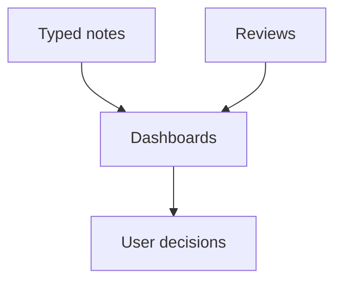

# LifeOS Enterprise — Dashboard Architecture

> Defines the read layer that surfaces the state of every operating system without becoming a source of truth itself.

---

## Overview

Dashboards are read-only operating surfaces built from typed notes.
They aggregate status, priorities, and review context into views that support action.
They are command centers, not storage.

This document defines:
- dashboard roles in the architecture
- dashboard taxonomy by operating system
- data and rendering constraints
- future implementation boundaries

---

## Architectural Principles

### 1. Dashboards Are Views, Not Data
Deleting a dashboard must never delete information.

### 2. Scoped Inputs Only
Every dashboard must read from well-bounded slices of the vault.

### 3. Actionable by Default
A dashboard should support a decision, a review, or a next action.

### 4. Replaceable Presentation
The view layer may evolve without changing canonical note storage.

### 5. Performance Matters
The dashboard layer must stay responsive as the vault scales.

---

## Read-Layer Model

---

## Dashboard Taxonomy

| Dashboard Family | Purpose |
|------------------|---------|
| Executive Dashboards | Strategic priorities, goals, risks, and portfolio alignment |
| Business Dashboards | Entity health, relationships, documents, opportunities |
| Project Dashboards | Active work, next actions, milestones, blockers |
| Knowledge Dashboards | Maps, references, recent learnings, retrieval surfaces |
| Learning Dashboards | Active study themes, resources, practice, skill reviews |
| System Dashboards | Vault health, review health, automation health |

---

## Required Dashboard Roles

| Dashboard | Architectural Role |
|----------|--------------------|
| Home / Command Center | Daily operating entry point |
| Executive Review View | Strategic alignment and priority control |
| Projects Dashboard | Portfolio execution control |
| Business Portfolio View | Commercial context and entity health |
| Knowledge Map | Retrieval and synthesis surface |
| Learning View | Capability-development overview |
| Weekly Review View | Review workflow support |
| System Health View | Automation, schema, and review hygiene |

---

## Data Contracts

1. Dashboard logic reads from metadata and linked note structure.
2. Dashboards must not require hidden state.
3. Draft notes are excluded by default.
4. Archived notes are excluded unless a dashboard is explicitly historical.
5. Dashboard categories mirror the operating-system boundaries in `ARCHITECTURE.md`.

---

## Implementation Deferrals

The following are intentionally deferred:
- Dataview queries
- dashboard note contents
- mobile layout tuning details
- plugin-specific rendering configuration

---

## Architectural Notes

- Dashboard Architecture is the primary user-facing read layer.
- It depends on the integrity of the metadata schema and object model.
- Its job is to reduce cognitive load, not to introduce more system complexity.
