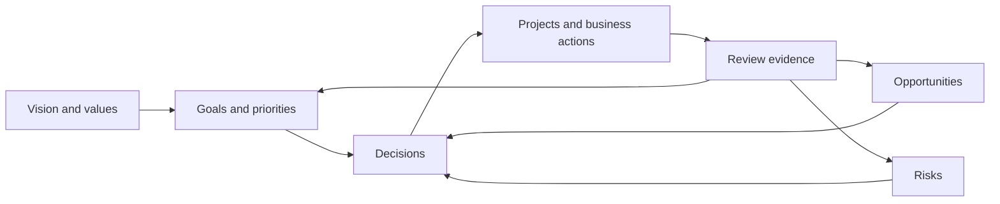

# LifeOS Enterprise — Executive Operating System

> Defines the strategic control layer that sets direction, evaluates outcomes, and governs the rest of LifeOS Enterprise.

---

## Purpose

Executive OS is the strategic control plane for LifeOS Enterprise.
It translates vision into priorities, priorities into portfolio choices, and review evidence into directional decisions.

## Responsibilities

- Set strategic priorities across life and business domains
- Approve, pause, or retire major initiatives
- Maintain goal hierarchy, decision records, and risk posture
- Run weekly, monthly, quarterly, and annual strategic reviews
- Resolve conflicts between competing priorities or systems

## Scope

### In Scope
- Goal hierarchy and strategic themes
- Portfolio-level prioritization
- Strategic decisions and review outcomes
- Risk and opportunity oversight
- Cross-system governance

### Out of Scope
- Daily task execution
- Detailed project delivery mechanics
- Raw capture and filing workflows
- Plugin, automation, or Dataview implementation

## Inputs

- Goals and constraints from long-horizon planning
- Portfolio status from Project OS
- Operating metrics and risk posture from Business OS
- Patterns and evidence from Knowledge OS
- Capability gaps from Learning OS
- Summaries and alerts from AI OS and Automation OS

## Outputs

- Approved goals and strategic priorities
- Start / stop / continue / redesign decisions
- Portfolio directives for Project OS and Business OS
- Review conclusions, risks, and opportunity calls
- KPI targets and governance thresholds

## Core Objects

| Object | Role |
|--------|------|
| `goal` | Defines intended strategic outcomes |
| `area` | Groups responsibilities and long-term domains |
| `decision` | Records strategic choices and rationale |
| `review` | Captures periodic strategic assessment |
| `risk` | Tracks downside exposure requiring attention |
| `opportunity` | Tracks upside bets requiring evaluation |
| `project` | Receives strategic authorization and constraints |
| `business` | Receives strategic priorities and portfolio direction |

## Metadata Requirements

Executive objects rely on the common schema in [METADATA_SCHEMA.md](./METADATA_SCHEMA.md) and should emphasize `status`, `priority`, `owner`, `review`, `deadline`, `impact`, `effort`, and explicit links to related `area`, `project`, and `business` notes.

## Relationships

| Adjacent System | Executive OS Sends | Executive OS Receives |
|-----------------|-------------------|------------------------|
| Business OS | business priorities, growth constraints, risk appetite | operating metrics, financial posture, entity health |
| Project OS | approved goals, portfolio priorities, stop/start directives | project status, blockers, completion outcomes |
| Knowledge OS | review questions, synthesis demand | decisions, lessons, pattern summaries |
| Learning OS | capability priorities, learning themes | skill gaps, learning progress, curriculum outcomes |
| AI OS | approved use cases and guardrails | summaries, decision support drafts |
| Automation OS | cadence rules and governance triggers | reminders, validation signals, audit logs |

## Workflows

### Strategic Control Loop
1. Gather evidence from dashboards, reviews, and operating-system outputs.
2. Compare current state against goals, constraints, and risk tolerance.
3. Decide what to start, stop, continue, accelerate, or redesign.
4. Push directives into Business OS, Project OS, and Learning OS.
5. Inspect the next review cycle for proof of improvement or drift.

## Dashboards

- Executive Command Center
- Weekly Review
- Monthly Review
- Business Dashboard
- Project Dashboard
- KPI Dashboard

## Review Process

| Cadence | Purpose | Primary Outputs |
|---------|---------|-----------------|
| Weekly | Reprioritize and surface urgent drift | priority updates, follow-up decisions |
| Monthly | Evaluate portfolio health | project corrections, business focus changes |
| Quarterly | Reassess strategic bets | goal resets, major resource shifts |
| Annual | Redesign the next operating year | themes, outcomes, retirement decisions |

## KPIs

- Percentage of active goals linked to active initiatives
- Percentage of strategic decisions reviewed on time
- Number of unmanaged high-impact risks
- Goal progress velocity by quarter
- Ratio of active projects aligned to current priorities

## Success Criteria

- Strategic priorities remain current and visible
- Every major initiative has explicit executive sponsorship or approval logic
- Risks and opportunities are reviewed before they become surprises
- Lower operating systems can explain why work is active
- Reviews consistently produce concrete decisions

## Future Expansion

- Scenario planning support for major decisions
- Portfolio balancing rules across time, money, and attention
- Deeper finance and CRM rollups
- Formal architecture decision record workflow
