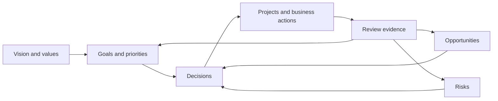

# LifeOS Enterprise — Executive Operating System

> Defines the strategic control layer that sets direction, evaluates outcomes, and governs the rest of LifeOS Enterprise.

---

## Overview

The Executive Operating System is the strategy layer of LifeOS Enterprise.
It answers five recurring questions:

1. What matters most right now?
2. What outcomes are we committed to?
3. Where is risk increasing?
4. What opportunities deserve attention?
5. What should stop, continue, or change?

Executive OS does not execute work directly. It governs portfolios, reviews evidence, and issues direction to the systems below it.

---

## Scope

### In Scope
- Goal hierarchy and strategic priorities
- Review cadences above the daily level
- Decision logging and decision review
- Risk and opportunity oversight
- Portfolio alignment across areas, projects, and businesses

### Out of Scope
- Day-to-day task execution
- Detailed project delivery mechanics
- Raw knowledge capture
- Plugin or automation implementation details

---

## Core Components

| Component | Primary Objects | Responsibility |
|----------|-----------------|----------------|
| Strategic Intent | `goal`, `area` | Define desired outcomes and domain priorities |
| Governance | `decision`, `review` notes | Record strategic choices and their rationale |
| Portfolio Control | `project`, `business` | Approve, pause, accelerate, or retire work |
| Risk Posture | `risk`, `opportunity` | Monitor downside and upside across the system |
| Review Loop | weekly, monthly, quarterly, annual reviews | Turn evidence into direction |

---

## Planning Horizons

| Horizon | Primary Question | Main Outputs |
|--------|------------------|--------------|
| Weekly | What needs attention now? | short-cycle priority updates |
| Monthly | Are active efforts aligned? | project and area corrections |
| Quarterly | Are we advancing the right bets? | goal resets, portfolio changes |
| Annual | What kind of year are we designing? | major goals, themes, retirement decisions |

---

## Operating Model

### Control Loop

1. Executive OS receives review evidence from dashboards, reviews, and knowledge synthesis.
2. It compares current state against goals and strategic constraints.
3. It issues decisions: continue, pause, start, stop, or redesign.
4. Those decisions feed Business OS, Project OS, and Learning OS.
5. The next review cycle evaluates whether the decision improved reality.

---

## Interfaces to Other Systems

| Adjacent System | Executive OS Sends | Executive OS Receives |
|-----------------|-------------------|------------------------|
| Business OS | business priorities, growth constraints, risk appetite | operating metrics, financial posture, entity health |
| Project OS | approved goals, portfolio priorities, stop/start directives | project status, blockers, completion outcomes |
| Knowledge OS | review questions, synthesis demand | decisions, lessons, pattern summaries |
| Learning OS | capability priorities, learning themes | skill gaps, learning progress, curriculum outcomes |
| AI OS | approved use cases and guardrails | summaries, decision support drafts |
| Automation OS | cadence rules and governance triggers | reminders, validation signals, audit logs |

---

## Executive Views

The Executive OS requires read-only views, not new sources of truth.

| View | Purpose |
|------|---------|
| Executive Home | Current priorities, critical risks, strategic commitments |
| Quarterly Portfolio Review | Goal-to-project alignment and project mix |
| Decision Register | Open and reviewed strategic decisions |
| Risk & Opportunity Board | Active downside and upside positions |
| Annual Design View | Themes, major goals, system redesign items |

---

## Governance Rules

1. Every active major goal must map to at least one active project, business initiative, or learning objective.
2. Every strategic decision must have an explicit review mechanism.
3. Risks without owners are governance failures.
4. Opportunities without a go/no-go decision age into noise and must be resolved.
5. Executive OS can pause lower-level work when alignment is broken.

---

## Architectural Notes

- Executive OS is the highest human-decision layer.
- It depends on evidence from other systems, not intuition alone.
- It should remain effective even if AI, automation, or dashboards are unavailable.
- Strategic reviews must be possible from canonical notes only.
