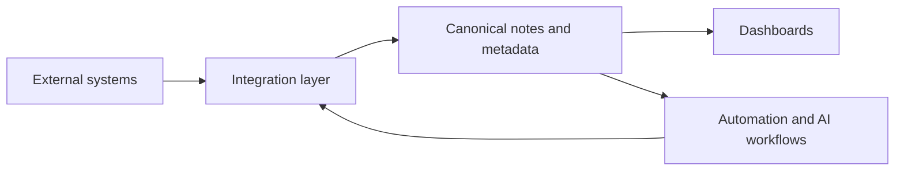

# LifeOS Enterprise — Integration Architecture

> Defines the external integration strategy for LifeOS Enterprise and the rules that govern authentication, data flow, security, and future automation.

---

## Purpose

Integration Architecture defines how LifeOS Enterprise interacts with external systems without violating markdown portability, canonical ownership, or privacy constraints.

## Principles

1. Local files remain the source of truth unless explicitly documented otherwise.
2. Pull-first and link-first patterns are preferred over uncontrolled sync.
3. Every mapped field needs an owner, direction, and security posture.
4. Sensitive integrations require explicit human approval and reviewability.
5. Automation follows integration architecture; it does not invent it.

## Architecture Model

## Integration Specifications

### GitHub
- **Purpose:** Version control, issue/PR context, architecture governance, and automation hosting.
- **Authentication:** Git credentials, SSH keys, or scoped tokens managed outside the vault.
- **Data Flow:** Bidirectional for repository metadata; LifeOS stores links, decisions, and project context.
- **Objects affected:** `project`, `decision`, `document`, `workflow`, `review`.
- **Security:** Protect tokens, avoid leaking sensitive note content, keep repo access scoped.
- **Risks:** Over-coupling personal workflows to repo mechanics, accidental publication.
- **Future Automation:** PR creation, release notes, issue sync, review reminders.

### Obsidian Sync
- **Purpose:** Secure vault synchronization across trusted devices.
- **Authentication:** Obsidian account authentication managed by the client.
- **Data Flow:** Bidirectional sync of vault files and supported settings.
- **Objects affected:** All markdown notes, selected configs, attachments.
- **Security:** Sensitive notes require trust in device security and provider controls.
- **Risks:** Sync conflicts, accidental propagation of bad changes, provider dependency.
- **Future Automation:** Sync-health checks and conflict review prompts.

### Google Calendar
- **Purpose:** Bring time commitments into daily planning, reviews, and meeting prep.
- **Authentication:** OAuth with calendar-scoped access.
- **Data Flow:** Pull-first into notes, dashboards, or temporary context; limited push for confirmed events only.
- **Objects affected:** `meeting`, `task`, `review`, `project`.
- **Security:** Minimize scope and avoid broader permissions than necessary.
- **Risks:** Duplicate event truth, stale meeting mappings, privacy exposure.
- **Future Automation:** Daily brief generation, meeting-note scaffolding, review scheduling.

### Google Drive
- **Purpose:** Reference and retrieve external documents while keeping LifeOS link-first.
- **Authentication:** OAuth with drive-scoped access.
- **Data Flow:** Link-first with optional metadata pull for titles, owners, and dates.
- **Objects affected:** `document`, `project`, `business`, `knowledge`.
- **Security:** Limit access scopes and avoid mirroring sensitive documents unnecessarily.
- **Risks:** Broken links, permission drift, overuse of external files as hidden truth.
- **Future Automation:** Document-register updates, renewal tracking, attachment indexing.

### Gmail
- **Purpose:** Convert important email into tasks, notes, relationship context, or business records.
- **Authentication:** OAuth with mail-read scopes and send scope only if needed later.
- **Data Flow:** Pull-first from selected messages into inbox, meeting, CRM, or business workflows.
- **Objects affected:** `task`, `meeting`, `person`, `company`, `document`, `business`.
- **Security:** High sensitivity; use minimal scopes and explicit capture criteria.
- **Risks:** Privacy leakage, noisy ingestion, duplicate communication records.
- **Future Automation:** VIP email capture, meeting follow-up extraction, decision logging suggestions.

### Slack
- **Purpose:** Capture decisions, tasks, and operating context from communication channels.
- **Authentication:** OAuth or app token scoped to selected workspaces/channels.
- **Data Flow:** Selective pull of approved messages or threads into notes.
- **Objects affected:** `meeting`, `decision`, `task`, `project`, `knowledge`.
- **Security:** Restrict channel access and avoid wholesale transcript ingestion.
- **Risks:** Confidentiality issues, signal-to-noise overload, context stripping.
- **Future Automation:** Decision extraction, follow-up capture, incident summaries.

### Notion (migration guidance)
- **Purpose:** Support migration of structured content into markdown-first LifeOS notes.
- **Authentication:** OAuth or export-based migration tooling.
- **Data Flow:** One-way migration or selective pull into canonical markdown notes.
- **Objects affected:** `knowledge`, `project`, `document`, `goal`, `workflow`.
- **Security:** Sanitize exports and avoid leaking permissions or embedded secrets.
- **Risks:** Broken structure mapping, duplicate truth, unsupported block semantics.
- **Future Automation:** Migration audit reports, mapping checklists, duplicate detection.

### Readwise
- **Purpose:** Import highlights and reading signals into learning and knowledge workflows.
- **Authentication:** API token stored outside the vault when possible.
- **Data Flow:** Pull highlights and metadata into resource or capture flows.
- **Objects affected:** `resource`, `knowledge`, `review`.
- **Security:** Protect API tokens and imported private reading content.
- **Risks:** Highlight clutter, insufficient synthesis, vendor lock-in for reading memory.
- **Future Automation:** Highlight-to-note extraction and synthesis reminders.

### Zotero
- **Purpose:** Manage scholarly references and source metadata for knowledge work.
- **Authentication:** Local library access or API key where needed.
- **Data Flow:** Pull bibliographic metadata and links into resource and knowledge notes.
- **Objects affected:** `resource`, `knowledge`, `document`, `review`.
- **Security:** Protect local libraries and API credentials; preserve citation integrity.
- **Risks:** Citation drift, duplicate references, over-complex source workflows.
- **Future Automation:** Citation note scaffolds, bibliography sync, reading queue creation.

### Git
- **Purpose:** Version notes, templates, scripts, and documentation changes.
- **Authentication:** Local repo credentials, SSH keys, or provider-scoped tokens.
- **Data Flow:** Bidirectional between local repo and remote origin for tracked files.
- **Objects affected:** documentation, templates, scripts, selected vault artifacts.
- **Security:** Protect repo credentials and avoid committing secrets or sensitive content unintentionally.
- **Risks:** Merge conflicts, accidental publication, repo bloat if the wrong content is tracked.
- **Future Automation:** Backup checkpoints, change summaries, schema-change review prompts.

### AI providers
- **Purpose:** Supply external or local AI inference for governed AI OS workflows.
- **Authentication:** Provider API keys or local runtime access controls.
- **Data Flow:** Request/response using bounded context packets; outputs return to human review.
- **Objects affected:** `prompt`, `workflow`, `knowledge`, `review`, `decision`, `task` drafts.
- **Security:** Highest scrutiny; use local-first where sensitivity is high and never send more context than needed.
- **Risks:** Privacy leakage, hallucinations, cost drift, provider lock-in.
- **Future Automation:** Provider routing, evaluation logging, context redaction pipelines.

### Local file system
- **Purpose:** Integrate nearby documents, exports, attachments, and generated artifacts.
- **Authentication:** OS-level file permissions.
- **Data Flow:** Local link-first, with optional metadata pull or controlled file moves.
- **Objects affected:** `document`, `asset`, `knowledge`, `project`, attachments.
- **Security:** Protect local folders, backups, and device access.
- **Risks:** Path drift, accidental deletion, brittle absolute references outside the vault.
- **Future Automation:** Import queues, file renaming rules, archive packaging.

## Security and Governance Rules

1. Every integration declares authentication method, direction, and canonical owner.
2. Credentials never live inside canonical markdown files.
3. Sensitive data classes must be reviewed before cloud-bound integrations are activated.
4. Integration failures must be observable and non-destructive.
5. Migration paths must avoid creating duplicate sources of truth.

## Future Expansion

- Integration-by-integration field mapping specifications
- Conflict-resolution policies for the few justified bidirectional flows
- Richer provider-routing for AI and communication channels
- Test fixtures and audit logs for integration-driven automation
