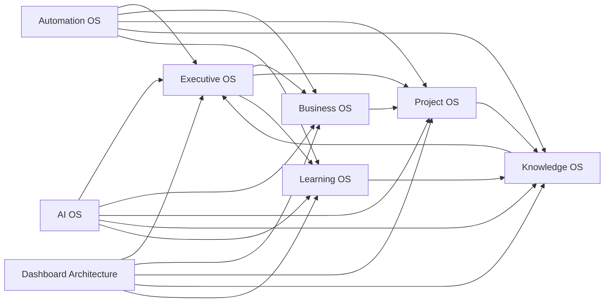

# LifeOS Enterprise — Integration Roadmap

> Defines how the operating systems interact internally and how external integrations should be sequenced after the architecture phase.

---

## Overview

The integration roadmap has two jobs:

1. Define the internal contracts between LifeOS subsystems.
2. Sequence future external integrations without violating portability, privacy, or canonical ownership.

This document remains architectural. It does not configure tools, plugins, or sync providers.

---

## Internal Interaction Blueprint

### Canonical Ownership

| Data Class | System of Record |
|-----------|------------------|
| Strategic intent and portfolio decisions | Executive OS |
| Commercial context and business posture | Business OS |
| Active delivery state | Project OS |
| Durable memory and reference context | Knowledge OS |
| Capability development state | Learning OS |
| Deterministic orchestration state | Automation OS logs and scripts |
| AI prompt, agent, and advisory context | AI OS |
| Read surfaces | Dashboard Architecture |

### Internal Data Flow

### Internal Contract Rules

1. Every integration must respect one canonical source for each fact.
2. Cross-system movement happens through typed metadata and linked notes.
3. Dashboards are read-only consumers.
4. Automation can move, create, or flag notes only within documented rules.
5. AI can suggest, summarize, and classify, but not become the source of truth.

---

## External Integration Categories

| Category | Example Systems | Typical Direction | Architectural Purpose |
|---------|------------------|-------------------|-----------------------|
| Calendar | Google Calendar, Outlook | Pull-first | Bring time commitments into reviews and meeting prep |
| Email | Gmail, Outlook | Pull-first | Convert important communications into notes or tasks |
| Task Tools | Todoist, Things, Microsoft To Do | Bidirectional only if ownership is explicit | Coordinate execution without replacing context |
| Documents | Google Drive, OneDrive, Dropbox | Link-first | Preserve reference to external artifacts |
| Finance | Banking exports, Stripe, accounting tools | Pull-first | Support business and finance awareness |
| CRM / Contacts | Google Contacts, iCloud Contacts | Pull-first | Reduce duplicate person/company maintenance |
| Communication | Slack, Teams | Selective pull | Capture decisions and action items |
| AI Providers | Ollama, OpenAI, Anthropic | Request/response | Augment synthesis and retrieval |

---

## Integration Patterns

| Pattern | Use When | Constraints |
|--------|----------|-------------|
| Link-only | External system remains canonical | Best default for documents and rich external apps |
| Pull-then-normalize | LifeOS needs structured local context | Must preserve source attribution |
| Push notification | LifeOS needs to trigger action elsewhere | Must not create duplicate truth |
| Bidirectional sync | Both systems truly need active state | Allowed only with explicit field ownership |
| Event-triggered automation | Timeliness matters | Must be idempotent and observable |

---

## Sequencing Roadmap

### Phase A — Internal Foundation
- Finalize object model, metadata schema, and folder hierarchy
- Finalize operating-system documents and review contracts
- Define dashboard, automation, and AI boundaries

### Phase B — Local Operating Integrations
- Calendar ingestion for meeting and review context
- Local document linking strategy
- Frontmatter validation and link integrity automation
- Local-first AI evaluation

### Phase C — Controlled External Systems
- Email-to-inbox capture
- Contact sync strategy
- Business document and finance awareness feeds
- Optional task-tool coordination with explicit ownership rules

### Phase D — Advanced Augmentation
- Privacy-aware AI workflows
- Event-driven business and project automations
- Broader reporting and briefing generation
- Multi-source reconciliation rules where justified

---

## Security, Privacy, and Consistency Rules

1. Local-first is preferred for any integration handling sensitive data.
2. Cloud integrations require explicit data-classification rules before activation.
3. Every external field mapped into LifeOS must have an owner and sync direction.
4. Conflicts resolve in favor of the documented canonical source.
5. Every automated integration needs an observable log or audit trail.

---

## Implementation Deferrals

The following remain intentionally deferred until later phases:

- Specific sync provider selection
- Plugin configuration
- Dataview queries
- Obsidian template implementation
- Credentials, API setup, and runtime automation wiring
