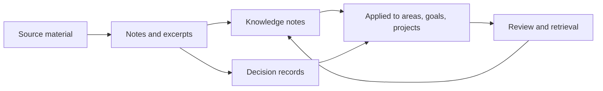

# LifeOS Enterprise — Knowledge Operating System

> Defines how LifeOS Enterprise captures durable knowledge, preserves context, and turns work into reusable understanding.

---

## Overview

Knowledge OS is the memory layer of LifeOS Enterprise.
It ensures that information does not remain trapped inside meetings, projects, or consumed resources.
It answers:

- What do I know?
- Why do I believe it?
- Where did it come from?
- Where does it apply?
- How can I retrieve it when needed?

---

## Scope

### In Scope
- Knowledge capture and synthesis
- Resource-to-knowledge conversion
- Decision and document memory
- Relationship mapping between notes
- Retrieval surfaces and review support

### Out of Scope
- Search engine implementation details
- External knowledge sync tooling
- Query implementation details

---

## Knowledge Architecture

| Domain | Primary Objects | Function |
|-------|-----------------|----------|
| Source Material | `resource`, `document`, `meeting` | Raw inputs and evidence |
| Durable Memory | `knowledge`, `decision` | Codified understanding and rationale |
| Applicability | `area`, `project`, `goal`, `business` links | Where knowledge matters |
| Retrieval | dashboards, MOCs, indexes | Surface what is relevant |
| Governance | reviews, metadata rules, archival | Keep the graph coherent |

---

## Capture-to-Insight Flow

### Knowledge Pipeline

1. Capture source context from meetings, resources, and documents.
2. Distill the durable idea into a typed note.
3. Link the note to the areas, goals, or projects where it matters.
4. Surface it during reviews, planning, and active work.
5. Update or archive it as reality changes.

---

## Retrieval Model

| Retrieval Surface | Purpose |
|------------------|---------|
| Area knowledge maps | Domain-specific operating memory |
| Project context packs | Prior art, decisions, and reference material |
| Review synthesis | Patterns and lessons for executive review |
| Learning review surfaces | Resources converted into understanding |
| Search and backlinks | Direct lookup and discovery |

---

## Interfaces to Other Systems

| Adjacent System | Knowledge OS Sends | Knowledge OS Receives |
|-----------------|-------------------|----------------------|
| Executive OS | patterns, decision history, evidence for prioritization | strategic review questions and synthesis demand |
| Business OS | commercial memory, reusable operating playbooks | contracts, reports, meeting context |
| Project OS | prior art, references, project history | execution outputs and lessons learned |
| Learning OS | durable concepts, linked resources, knowledge gaps | highlighted resources and study reflections |
| Automation OS | validation targets, review targets, archival rules | indexing, stale-note checks, integrity checks |
| AI OS | structured context for synthesis and retrieval | suggested links, summaries, classification support |

---

## Governance Rules

1. Knowledge notes store synthesized understanding, not copied source dumps.
2. Source lineage should always be recoverable.
3. Knowledge is linked to application contexts whenever possible.
4. Retrieval structures are views; the note remains the source of truth.
5. Archival should preserve historical reasoning, not erase it.

---

## Architectural Notes

- Knowledge OS is the compounding asset of the whole architecture.
- It is fed by every other operating system.
- It must remain useful without AI or automation, though both can improve its reach.
