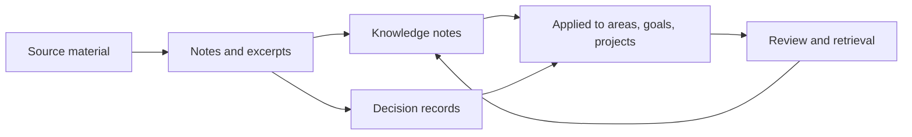

# LifeOS Enterprise — Knowledge Operating System

> Defines how LifeOS Enterprise captures durable knowledge, preserves context, and turns work into reusable understanding.

---

## Purpose

Knowledge OS is the memory layer of LifeOS Enterprise.
It converts information, meetings, documents, and work output into durable notes that can be retrieved, linked, and applied later.

## Responsibilities

- Capture and synthesize durable knowledge from source material
- Preserve source lineage and application context
- Maintain links between knowledge, decisions, resources, and work
- Support retrieval during execution, reviews, and learning
- Keep the knowledge graph coherent through review and archival

## Scope

### In Scope
- Knowledge capture and synthesis
- Resource-to-knowledge conversion
- Decision and document memory
- Relationship mapping between notes
- Retrieval surfaces and governance rules

### Out of Scope
- Search engine implementation specifics
- External sync tooling configuration
- Dataview query implementation details
- Raw source storage outside markdown and metadata conventions

## Inputs

- Meetings, documents, and resources from daily work
- Deliverables, decisions, and lessons from Project OS
- Strategic questions from Executive OS
- Commercial memory from Business OS
- Learning reflections and resource takeaways from Learning OS
- Suggested links, summaries, and extraction help from AI OS

## Outputs

- Durable `knowledge` notes and decision memory
- Application links to goals, projects, businesses, and areas
- Retrieval surfaces for dashboards, maps, and reviews
- Evidence packages for executive, business, and learning reviews
- Governance signals for automation and integrity checks

## Core Objects

| Object | Role |
|--------|------|
| `knowledge` | Stores synthesized understanding |
| `decision` | Stores rationale and historical choices |
| `resource` | Represents source material |
| `document` | Stores formal source artifacts |
| `meeting` | Captures discussion context and action evidence |
| `moc` | Curates a manual retrieval surface |
| `area` | Provides domain context |
| `project` | Provides application context |
| `business` | Provides commercial application context |

## Metadata Requirements

Knowledge notes should prioritize `type`, `status`, `created`, `updated`, `tags`, source references, related-note links, `confidence`, `review`, and explicit applicability markers to `resource`, `project`, `area`, `business`, or `decision` notes.

## Relationships

| Adjacent System | Knowledge OS Sends | Knowledge OS Receives |
|-----------------|-------------------|----------------------|
| Executive OS | patterns, decision history, evidence for prioritization | strategic review questions and synthesis demand |
| Business OS | commercial memory, reusable operating playbooks | contracts, reports, meeting context |
| Project OS | prior art, references, project history | execution outputs and lessons learned |
| Learning OS | durable concepts, linked resources, knowledge gaps | highlighted resources and study reflections |
| AI OS | structured context for synthesis and retrieval | suggested links, summaries, classification support |
| Automation OS | validation targets, review targets, archival rules | indexing, stale-note checks, integrity checks |

## Workflows

### Knowledge Workflow
1. Capture source context from meetings, resources, documents, or operations.
2. Distill the durable idea into a typed note.
3. Link the note to the places where it matters.
4. Surface the note during work, reviews, and planning.
5. Update, supersede, or archive the note as reality changes.

## Dashboards

- Knowledge Dashboard
- Weekly Review
- Project Dashboard
- Learning Dashboard
- Executive Command Center

## Review Process

| Cadence | Purpose | Primary Outputs |
|---------|---------|-----------------|
| Weekly | Convert fresh inputs into durable notes | new knowledge notes, clarified links |
| Monthly | Clean retrieval structures and stale notes | relinked notes, archive candidates |
| Quarterly | Reassess high-value domains and knowledge gaps | map refreshes, research priorities |

## KPIs

- Percentage of high-value projects with linked lessons or decisions
- Percentage of active resources converted into synthesized knowledge
- Number of stale high-value notes missing review
- Average time from capture to synthesis
- Retrieval success during reviews or active work

## Success Criteria

- Important knowledge is retrievable without remembering its folder path
- Source lineage is recoverable for durable claims
- Work outputs become reusable context instead of dead artifacts
- Retrieval surfaces reduce search friction during execution and review
- Archival preserves reasoning instead of destroying context

## Future Expansion

- Stronger note confidence and evidence-weight conventions
- Topic-level review cadences for deep domains
- Decision-to-knowledge promotion rules
- Local-first semantic retrieval augmentation layered on top of links
