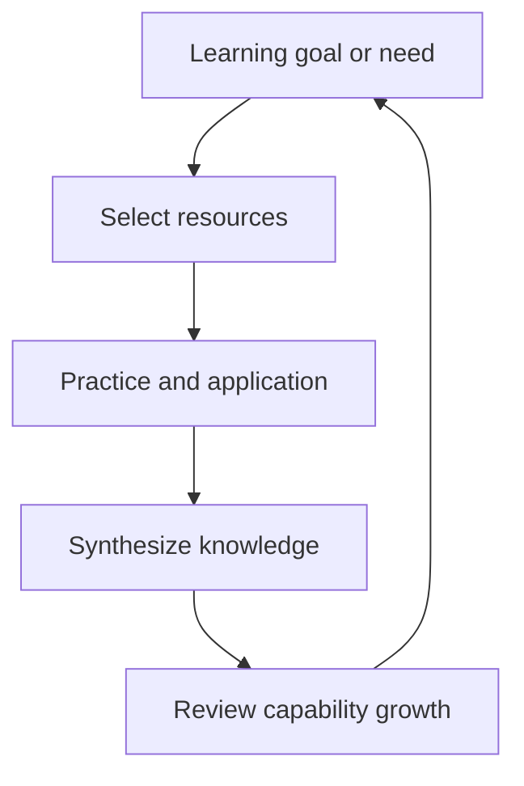

# LifeOS Enterprise — Learning Operating System

> Defines the architecture for deliberate learning, capability growth, and turning study into applied performance.

---

## Overview

Learning OS manages intentional skill development.
It answers:

- What am I trying to learn?
- Why does it matter now?
- Which resources support it?
- How is learning being applied in real work or life?
- What capabilities are strengthening over time?

Learning OS is distinct from Knowledge OS: learning is the process of acquiring capability; knowledge is the durable memory produced by that process.

---

## Scope

### In Scope
- Learning priorities and capability themes
- Resource selection and study flows
- Practice, reflection, and synthesis loops
- Learning-linked goals, projects, and reviews

### Out of Scope
- LMS implementation
- Spaced repetition tooling details
- Plugin or sync configuration

---

## Learning Model

| Layer | Primary Objects | Responsibility |
|------|-----------------|----------------|
| Intent | `goal`, `area`, `project` | Why this learning matters |
| Input | `resource`, `workflow` | What is being studied and how |
| Practice | projects, tasks, exercises | Where learning becomes performance |
| Synthesis | `knowledge`, review notes | What understanding is retained |
| Review | monthly, quarterly reviews | Whether capability is actually improving |

---

## Learning Loop

### Core Workflows

1. Identify a capability gap from Executive OS, Business OS, or Project OS.
2. Define the learning objective and supporting resources.
3. Attach practice to live projects or dedicated exercises.
4. Convert takeaways into knowledge notes.
5. Review whether learning changed behavior or outcomes.

---

## Interfaces to Other Systems

| Adjacent System | Learning OS Sends | Learning OS Receives |
|-----------------|-------------------|----------------------|
| Executive OS | capability progress, skill gaps, learning outcomes | strategic priorities and long-horizon capability needs |
| Business OS | role readiness and domain knowledge growth | commercial demands and role-specific capability gaps |
| Project OS | applied skills, practice outputs, readiness signals | real-world practice opportunities |
| Knowledge OS | synthesized lessons and applied insights | curated resources and durable concepts |
| Automation OS | reminders, reading cadences, review schedules | workflow creation and stale-learning signals |
| AI OS | tutoring, summarization, curriculum support | bounded prompts and structured learning context |

---

## Learning Views

| View | Purpose |
|------|---------|
| Learning Dashboard | Active study themes, resources in progress, next reviews |
| Resource Pipeline | What is queued, active, or synthesized |
| Skill Growth Review | Capability changes over time |
| Application Tracker | Which projects are exercising which skills |

---

## Governance Rules

1. Learning should map to an area, goal, or active role.
2. Resources without synthesis eventually become clutter.
3. Learning is complete only when applied or deliberately parked.
4. Capability reviews should focus on changed behavior, not consumed volume.
5. Learning history remains valuable even after topics are archived.

---

## Architectural Notes

- Learning OS bridges aspiration and applied competence.
- It shares resources with Knowledge OS but owns the developmental workflow.
- It becomes more valuable when tied directly to live projects and reviews.
