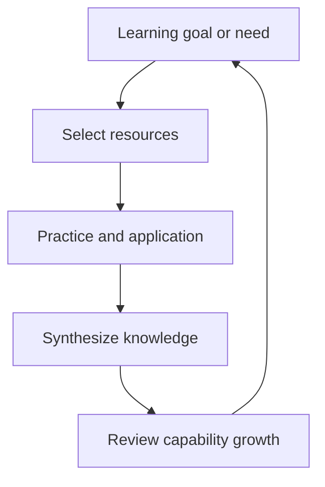

# LifeOS Enterprise — Learning Operating System

> Defines the architecture for deliberate learning, capability growth, and turning study into applied performance.

---

## Purpose

Learning OS manages intentional capability development inside LifeOS Enterprise.
It ensures learning is connected to real goals, real work, and measurable growth rather than passive consumption.

## Responsibilities

- Define learning priorities and capability gaps
- Select and sequence resources for active learning goals
- Connect practice to projects, exercises, and operational needs
- Convert learning into applied behavior and durable knowledge
- Review whether capability is improving over time

## Scope

### In Scope
- Learning goals and capability themes
- Resource selection and study workflows
- Practice, reflection, and synthesis loops
- Learning-linked reviews, projects, and dashboards

### Out of Scope
- LMS implementation or course-platform replacement
- Spaced repetition tooling configuration
- External sync or plugin setup details

## Inputs

- Capability priorities from Executive OS
- Role and domain demands from Business OS
- Practice opportunities from Project OS
- Resources and prior knowledge from Knowledge OS
- Learning prompts and tutoring help from AI OS
- Reminder and cadence support from Automation OS

## Outputs

- Learning plans and active study priorities
- Resource pipelines and practice commitments
- Applied skill evidence tied to projects or operations
- Synthesized notes and reflections for Knowledge OS
- Capability trend visibility for strategic review

## Core Objects

| Object | Role |
|--------|------|
| `goal` | Defines why the capability matters |
| `resource` | Provides learning input |
| `workflow` | Encodes recurring study or review process |
| `project` | Supplies applied practice context |
| `knowledge` | Stores what is retained and usable |
| `review` | Captures periodic capability assessment |
| `area` | Anchors learning to a life or work domain |

## Metadata Requirements

Learning notes should emphasize `status`, `priority`, `owner`, `review`, explicit links from learning items to `goal`, `area`, `project`, and `resource`, plus `impact` and timebox markers when learning supports a live initiative.

## Relationships

| Adjacent System | Learning OS Sends | Learning OS Receives |
|-----------------|-------------------|----------------------|
| Executive OS | capability progress, skill gaps, learning outcomes | strategic priorities and long-horizon capability needs |
| Business OS | role readiness and domain knowledge growth | commercial demands and role-specific capability gaps |
| Project OS | applied skills, practice outputs, readiness signals | real-world practice opportunities |
| Knowledge OS | synthesized lessons and applied insights | curated resources and durable concepts |
| AI OS | tutoring, curriculum synthesis, reflection prompts | bounded prompts and structured learning context |
| Automation OS | reminders, reading cadences, review schedules | workflow creation and stale-learning signals |

## Workflows

### Learning Workflow
1. Identify a capability gap or growth target.
2. Select resources and define a learning path.
3. Attach practice to live work or deliberate exercises.
4. Convert takeaways into durable knowledge.
5. Review whether behavior, output quality, or confidence improved.

## Dashboards

- Learning Dashboard
- Daily Dashboard
- Weekly Review
- Knowledge Dashboard
- Executive Command Center

## Review Process

| Cadence | Purpose | Primary Outputs |
|---------|---------|-----------------|
| Weekly | Maintain learning momentum | next study actions, synthesis prompts |
| Monthly | Evaluate active learning themes | continue / pause / refocus decisions |
| Quarterly | Assess meaningful capability change | growth summary, new capability targets |

## KPIs

- Percentage of active learning goals tied to a goal, area, or project
- Percentage of active resources with a next step or synthesis outcome
- Number of stalled learning efforts past review cadence
- Frequency of learning insights applied to projects or operations
- Capability growth trend by quarter

## Success Criteria

- Learning efforts are tied to meaningful outcomes instead of vague aspiration
- Active resources are either being used, synthesized, or intentionally parked
- Practice is visible, not assumed
- Learning produces durable knowledge and measurable behavior change
- Review cadence prevents learning clutter from accumulating

## Future Expansion

- Explicit capability taxonomy and skill-level rubric
- Resource quality scoring and curation rules
- Optional spaced-repetition layer that respects markdown portability
- Better project-to-learning matching for just-in-time growth
