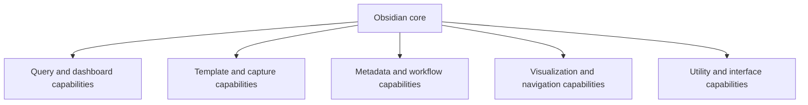

# LifeOS Enterprise — Plugin Architecture

> Defines the complete Obsidian plugin architecture for LifeOS Enterprise without introducing configuration yet.

---

## Purpose

Plugin Architecture defines which Obsidian plugins are justified, what capability each provides, and how plugin dependency is kept bounded.

## Principles

1. Capability first, plugin second.
2. Graceful degradation is mandatory.
3. Plugins must never become the source of truth.
4. Minimal overlap beats convenience stacking.
5. Configuration is deferred until the architecture is accepted.

## Capability Model

## Plugin Evaluations

### Dataview
- **Purpose:** Read-layer aggregation for dashboards and review surfaces.
- **Why selected:** Best fit for markdown-first, metadata-driven views.
- **Alternatives:** Manual MOCs, Canvas-only views, external BI tooling.
- **Dependencies:** Consistent YAML frontmatter and typed notes.
- **Configuration:** Query standards and performance boundaries are deferred.
- **Performance Impact:** High if queries are broad; requires scope discipline.
- **Security Considerations:** Low direct risk; main risk is hidden logic.
- **Maintenance:** Mature and core to the intended dashboard layer.

### Tasks
- **Purpose:** Task visibility and review across notes.
- **Why selected:** Aligns with project and review workflows without replacing markdown tasks.
- **Alternatives:** Native task lists, external task tools, Dataview task queries only.
- **Dependencies:** Consistent task syntax and project linking.
- **Configuration:** Filtering and status conventions are deferred.
- **Performance Impact:** Moderate at vault scale if task hygiene is weak.
- **Security Considerations:** Low; tasks remain in markdown.
- **Maintenance:** Strong ecosystem fit and low conceptual complexity.

### Templater
- **Purpose:** Dynamic note creation and structured scaffolding.
- **Why selected:** Best fit for metadata-aware template generation.
- **Alternatives:** Core templates, QuickAdd-only generation, manual note creation.
- **Dependencies:** Template library, metadata schema, and folder structure.
- **Configuration:** Template syntax and script architecture are deferred.
- **Performance Impact:** Low at runtime; complexity risk rises with scripting.
- **Security Considerations:** Scripts are powerful, so write behavior needs review.
- **Maintenance:** High value if scripts remain minimal and documented.

### QuickAdd
- **Purpose:** Fast capture, command launching, and structured note initiation.
- **Why selected:** Reduces friction for high-frequency capture and guided workflows.
- **Alternatives:** Command palette, Templater-only flows, mobile share capture.
- **Dependencies:** Templates, folder strategy, and optional Templater hooks.
- **Configuration:** Macros and capture menus are deferred.
- **Performance Impact:** Low.
- **Security Considerations:** Macro actions must remain transparent and reviewable.
- **Maintenance:** Useful if focused on a small set of core flows.

### Metadata Menu
- **Purpose:** Structured metadata editing inside notes.
- **Why selected:** Improves frontmatter usability without changing canonical storage.
- **Alternatives:** Manual YAML editing, properties UI, custom forms.
- **Dependencies:** Stable metadata schema.
- **Configuration:** Field definitions and forms are deferred.
- **Performance Impact:** Low to moderate depending on field complexity.
- **Security Considerations:** Low; risk is schema drift if forms diverge from docs.
- **Maintenance:** Valuable for lowering editing friction on structured notes.

### Calendar
- **Purpose:** Calendar navigation for daily and periodic notes.
- **Why selected:** Compact navigation surface for cadence-driven workflows.
- **Alternatives:** File explorer only, Periodic Notes navigation, custom links.
- **Dependencies:** Daily and periodic note conventions.
- **Configuration:** Display and date formats are deferred.
- **Performance Impact:** Low.
- **Security Considerations:** Low.
- **Maintenance:** Stable and narrowly scoped.

### Periodic Notes
- **Purpose:** Managed creation and navigation of daily, weekly, monthly, quarterly, and annual notes.
- **Why selected:** Closely matches the review-driven architecture.
- **Alternatives:** Templater-only generation, manual creation.
- **Dependencies:** Template library and review cadence definitions.
- **Configuration:** Date paths and review-note setup are deferred.
- **Performance Impact:** Low.
- **Security Considerations:** Low; note creation must still honor documented schema.
- **Maintenance:** High value due to alignment with reviews.

### Kanban
- **Purpose:** Visual workflow views for selected project or pipeline contexts.
- **Why selected:** Useful where stage-based visibility materially improves actionability.
- **Alternatives:** Dataview tables, Tasks filters, external PM tools.
- **Dependencies:** Clear rules on when boards are views versus sources of truth.
- **Configuration:** Board conventions are deferred.
- **Performance Impact:** Moderate for large boards.
- **Security Considerations:** Low; risk is duplicate canonical state.
- **Maintenance:** Optional but valuable for focused workflows only.

### Omnisearch
- **Purpose:** Fast retrieval across a growing vault.
- **Why selected:** Supports the retrieval goals of Knowledge OS.
- **Alternatives:** Core search, backlinks, MOCs only.
- **Dependencies:** Reasonable note hygiene and metadata quality.
- **Configuration:** Indexing behavior is deferred.
- **Performance Impact:** Moderate depending on vault size.
- **Security Considerations:** Low; local indexing only.
- **Maintenance:** Strong fit for scale-focused retrieval.

### Excalidraw
- **Purpose:** Diagramming for architecture, mapping, and visual synthesis.
- **Why selected:** Best fit for visual modeling that can still live in the vault.
- **Alternatives:** Mermaid only, Canvas, external whiteboarding tools.
- **Dependencies:** None beyond file storage discipline.
- **Configuration:** Drawing conventions are deferred.
- **Performance Impact:** Moderate for many large drawings.
- **Security Considerations:** Low.
- **Maintenance:** Valuable for architecture and concept mapping when used intentionally.

### Canvas
- **Purpose:** Spatial planning and relationship visualization.
- **Why selected:** Useful for exploratory modeling, project framing, and map-style views.
- **Alternatives:** Excalidraw, MOCs, Mermaid diagrams.
- **Dependencies:** Rules clarifying that Canvas is a view and planning aid, not canonical truth.
- **Configuration:** Usage conventions are deferred.
- **Performance Impact:** Moderate for complex boards.
- **Security Considerations:** Low; main risk is duplicate state.
- **Maintenance:** Helpful if constrained to high-value visual workflows.

### Commander
- **Purpose:** Streamline interface actions and repetitive commands.
- **Why selected:** Improves ergonomics for high-frequency workflows.
- **Alternatives:** Hotkeys, QuickAdd, native command palette.
- **Dependencies:** Stable command set from chosen plugins.
- **Configuration:** Ribbon and bindings are deferred.
- **Performance Impact:** Low.
- **Security Considerations:** Low; commands should stay transparent.
- **Maintenance:** Useful only if command sprawl is controlled.

### Buttons
- **Purpose:** Trigger guided actions from notes and dashboards.
- **Why selected:** Makes common workflows discoverable for review and operating surfaces.
- **Alternatives:** Links, QuickAdd commands, command palette.
- **Dependencies:** Stable command targets and templates.
- **Configuration:** Button placement and action patterns are deferred.
- **Performance Impact:** Low.
- **Security Considerations:** Button-triggered writes must remain deterministic and documented.
- **Maintenance:** Useful when tied to a small set of safe actions.

### Style Settings
- **Purpose:** Manage visual customization safely across theme-dependent settings.
- **Why selected:** Provides guardrails for presentation tuning without editing theme files.
- **Alternatives:** CSS snippets only, default theme behavior.
- **Dependencies:** Theme choices and visual standards.
- **Configuration:** Theme settings are deferred.
- **Performance Impact:** Low.
- **Security Considerations:** Low; presentation only.
- **Maintenance:** Helpful if UI polish matters, but not structurally required.

## Additional Plugin Recommendation

### Linter
- **Purpose:** Enforce consistent markdown and frontmatter structure.
- **Why selected:** Materially improves metadata consistency and reduces manual cleanup risk.
- **Alternatives:** Manual review, custom scripts, CI-only linting.
- **Dependencies:** Finalized markdown and frontmatter conventions.
- **Configuration:** Rule set is deferred.
- **Performance Impact:** Low when run on demand.
- **Security Considerations:** Low; changes should remain reviewable.
- **Maintenance:** Strong candidate because it supports schema hygiene directly.

## Dependency Rules

1. Dashboards may depend on Dataview, but data meaning must remain understandable without it.
2. Templates and capture flows may depend on Templater or QuickAdd, but files must remain plain markdown.
3. Metadata editing aids may improve ergonomics, not redefine schema.
4. Visual tools such as Canvas and Excalidraw are views, not sources of truth.
5. Interface helpers such as Commander and Buttons must not conceal high-impact actions.

## Future Expansion

- Plugin lifecycle states such as approved, trial, optional, or retired
- Compatibility testing matrix across desktop and mobile
- Performance baselines for large-vault dashboard and search behavior
- Security review checklist for future plugin additions
