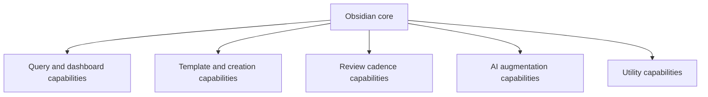

# LifeOS Enterprise — Plugin Architecture

> Defines the capability architecture for Obsidian plugins used by LifeOS Enterprise.

---

## Overview

LifeOS Enterprise uses plugins as capability providers, not as sources of system policy.
The plugin architecture answers:

- Which capabilities must the platform provide?
- Which plugins are candidates for those capabilities?
- What dependency boundaries keep the system portable?

This phase documents architectural roles only. It does not configure plugins.

---

## Design Principles

1. **Capability first** — document the needed capability before naming a plugin.
2. **Graceful degradation** — the vault remains usable if a plugin is disabled.
3. **Minimal overlap** — avoid multiple plugins competing for the same core job.
4. **Portability** — notes remain valid Markdown with YAML frontmatter.
5. **Configuration later** — architecture precedes setup.

---

## Capability Layers

---

## Capability Map

| Capability | Architectural Need | Candidate Plugin Role |
|-----------|--------------------|-----------------------|
| Querying | Read-layer aggregation for dashboards | Dataview-class capability |
| Templating | Dynamic note creation and scaffolding | Templater-class capability |
| Periodic note support | Review cadence and recurring notes | Periodic Notes-class capability |
| Search and navigation | Fast retrieval at vault scale | Omnisearch / Quick Switcher-class capability |
| Task visibility | Cross-note action tracking | Tasks-class capability |
| AI augmentation | Prompted synthesis and note assistance | Copilot-class capability |
| Linting and hygiene | Content consistency support | Linter-class capability |
| Authoring utilities | Markdown editing ergonomics | table/editor helpers |

---

## Dependency Rules

1. Plugin capabilities may enable workflows, but must not define canonical schemas.
2. Object model, metadata schema, and folder structure remain valid without plugins.
3. Dashboards may depend on query capability, but not on undocumented conventions.
4. AI capability is optional and strictly additive.
5. Utilities may improve authoring, but cannot become required to interpret notes.

---

## Evaluation Criteria

| Criterion | Why It Matters |
|-----------|----------------|
| Maintenance health | Reduces abandonment risk |
| Broad adoption | Signals stability |
| Performance | Protects large-vault usability |
| Portability impact | Limits lock-in |
| Role clarity | Prevents capability overlap |
| Failure mode | Ensures graceful degradation |

---

## Implementation Deferrals

The following remain deferred to later phases:
- version pinning
- plugin configuration files
- setup scripts
- plugin-specific workflow instructions

---

## Architectural Notes

- Plugin Architecture is an enablement layer beneath dashboards, automation, and AI.
- The system must still make sense from the Markdown files alone.
- Plugin configuration will only be introduced after the blueprint is accepted.
