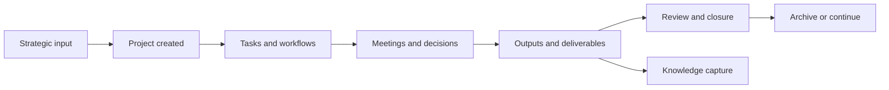

# LifeOS Enterprise — Project Operating System

> Defines the execution architecture that converts strategy into bounded work, tracks progress, and closes loops reliably.

---

## Purpose

Project OS is the delivery engine of LifeOS Enterprise.
It turns strategic priorities and business needs into executable work with clear outcomes, next actions, and closure rules.

## Responsibilities

- Authorize, structure, and track active projects
- Maintain next actions, milestones, dependencies, and blockers
- Keep execution aligned with strategy, business context, and review cadence
- Capture decisions, risks, and closure outcomes
- Route lessons learned into Knowledge OS

## Scope

### In Scope
- Project portfolio structure and lifecycle
- Task and workflow coordination
- Milestones, dependencies, and reviews
- Closure, archival, and evidence generation
- Interfaces to goals, businesses, dashboards, and AI workflows

### Out of Scope
- Team-scale PM replacement
- Advanced scheduling implementation
- Dataview, template, or plugin configuration details

## Inputs

- Strategic directives from Executive OS
- Commercial constraints and stakeholders from Business OS
- References and lessons from Knowledge OS
- Capability signals from Learning OS
- Reminders and summaries from Automation OS and AI OS

## Outputs

- Active project portfolio with explicit outcomes
- Task and workflow state for execution follow-through
- Project decisions, risks, and completion evidence
- Deliverables and lessons to downstream systems
- Status and trend visibility for dashboards and reviews

## Core Objects

| Object | Role |
|--------|------|
| `project` | Defines a bounded initiative and outcome |
| `task` | Represents the smallest actionable unit |
| `workflow` | Encodes repeatable execution patterns |
| `meeting` | Captures coordination and decisions |
| `decision` | Records material course corrections |
| `risk` | Tracks delivery threats |
| `goal` | Provides strategic justification |
| `business` | Provides commercial context |
| `document` | Stores deliverables and supporting artifacts |
| `knowledge` | Receives closure lessons and reusable context |

## Metadata Requirements

Project notes should emphasize `status`, `priority`, `owner`, `deadline`, `next_action`, `review`, explicit links between `project`, `task`, `goal`, `business`, and `risk`, plus milestone and archive markers that stay compatible with the common schema.

## Relationships

| Adjacent System | Project OS Sends | Project OS Receives |
|-----------------|------------------|---------------------|
| Executive OS | portfolio status, completion outcomes, blocked bets | approved priorities and stop/start decisions |
| Business OS | deliverables, stakeholder updates, document outputs | commercial constraints and entity context |
| Knowledge OS | project lessons, decisions, deliverables, meeting records | references, playbooks, prior art |
| Learning OS | practice opportunities and capability signals | skill-building plans that support execution |
| AI OS | bounded project context for briefings and synthesis | summaries, extraction, decision support drafts |
| Automation OS | scheduling events, status transitions, archival triggers | reminders, validation, stale-project flags |

## Workflows

### Delivery Workflow
1. Confirm that the work deserves project status and assign an outcome.
2. Define the next action, timing, dependencies, and review cadence.
3. Advance execution through tasks, workflows, meetings, and decisions.
4. Escalate blockers, risks, and trade-offs during review.
5. Close the loop with outcome confirmation, knowledge capture, and archive rules.

## Dashboards

- Project Dashboard
- Daily Dashboard
- Weekly Review
- Business Dashboard
- Executive Command Center

## Review Process

| Cadence | Purpose | Primary Outputs |
|---------|---------|-----------------|
| Daily | Keep active work moving | current focus, blocker escalation |
| Weekly | Validate project momentum and next actions | status corrections, schedule changes |
| Monthly | Confirm alignment with strategy and business needs | pause / continue / complete decisions |
| Closure | Capture results and lessons | deliverable confirmation, archive readiness |

## KPIs

- Percentage of active projects with a current next action
- Percentage of active projects reviewed on schedule
- Number of blocked projects older than tolerance
- Project completion rate by month or quarter
- Percentage of completed projects with linked lessons captured

## Success Criteria

- Every active project has one clear outcome and one clear next action
- Blockers, risks, and schedule pressure are visible early
- Reviews lead to action, not passive status logging
- Completed work leaves a reusable trail of deliverables and lessons
- Project load stays aligned with executive and business priorities

## Future Expansion

- Structured milestone and dependency object patterns
- Deeper external task-tool coordination rules
- More explicit archive packets for completed projects
- Capacity and workload balancing heuristics for portfolio reviews
