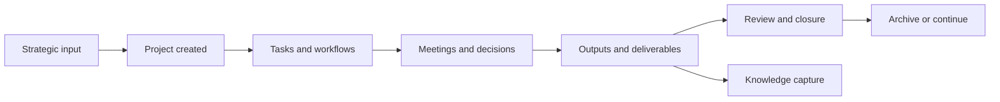

# LifeOS Enterprise — Project Operating System

> Defines the execution architecture that converts strategy into bounded work, tracks progress, and closes loops reliably.

---

## Overview

Project OS is the delivery engine of LifeOS Enterprise.
It answers:

- What outcomes are currently being pursued?
- What is the next action for each active effort?
- What is blocked, at risk, or overdue?
- What should be completed, paused, or archived?

Project OS is responsible for turning priorities into finished outcomes without losing context.

---

## Scope

### In Scope
- Project portfolio structure
- Project and task lifecycle management
- Workflows and recurring delivery processes
- Milestones, dependencies, reviews, and archival
- Interfaces to goals, businesses, knowledge, and dashboards

### Out of Scope
- Team-scale project management replacement
- Gantt or critical-path implementation details
- Template or Dataview implementation

---

## Core Architecture

| Layer | Primary Objects | Responsibility |
|------|-----------------|----------------|
| Portfolio | `project`, `goal`, `business`, `area` | Decide what active work exists |
| Execution | `task`, `meeting`, `workflow` | Move projects forward through concrete actions |
| Control | `risk`, `decision`, review notes | Detect and resolve delivery friction |
| Output | `document`, `knowledge` | Preserve artifacts and lessons |

---

## Delivery Flow

### Lifecycle States

| Stage | Purpose | Exit Condition |
|------|---------|----------------|
| Intake | Confirm the work deserves project status | clear outcome and owning area |
| Planning | Define outcome, timing, dependencies, next action | project is actionable |
| Active Delivery | Execute, review, and adapt | outcome achieved, paused, or abandoned |
| Closure | Confirm result, capture lessons, update linked objects | project completed or abandoned |
| Archive | Preserve history with discoverable context | archived project and related artifacts |

---

## Project Control Loop

1. A project is authorized by Executive OS or Business OS.
2. Project OS defines the outcome, area, timing, and next action.
3. Tasks, workflows, and meetings move the project forward.
4. Risks, decisions, and reviews surface friction early.
5. Completion triggers archival rules and knowledge capture.

---

## Interfaces to Other Systems

| Adjacent System | Project OS Sends | Project OS Receives |
|-----------------|------------------|---------------------|
| Executive OS | portfolio status, completion outcomes, blocked bets | approved priorities and stop/start decisions |
| Business OS | deliverables, stakeholder updates, document outputs | commercial constraints and entity context |
| Knowledge OS | project lessons, decisions, deliverables, meeting records | references, playbooks, prior art |
| Learning OS | practice opportunities and capability signals | skill-building plans that support execution |
| Automation OS | scheduling events, status transitions, archival triggers | reminders, validation, stale-project flags |
| AI OS | bounded project context for briefings and synthesis | summaries, extraction, decision support drafts |

---

## Project Views

| View | Purpose |
|------|---------|
| Project Command Center | Active projects, next actions, and blockers |
| Weekly Delivery Review | Projects without next actions, stale tasks, overdue outcomes |
| Milestone View | Upcoming commitments and completion pressure |
| Completed Work | Recently closed projects and lessons to harvest |
| Risk Overlay | Delivery threats and mitigation status |

---

## Governance Rules

1. Every active project must have one clear outcome and one clear next action.
2. Projects inherit context from area and business, but keep their own lifecycle.
3. Tasks are atomic and never replace the project outcome definition.
4. A project is not complete until its outcome, closure notes, and linked learnings are captured.
5. Projects that no longer justify attention must be paused or abandoned explicitly.

---

## Architectural Notes

- Project OS is the primary execution boundary in the system.
- It is intentionally compatible with external task tools, but remains the canonical context layer.
- It produces much of the evidence consumed by reviews, dashboards, automation, and AI workflows.
